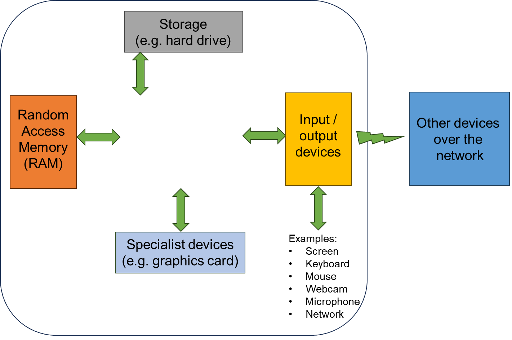

.. role:: console(code)
   :language: console

Formative quiz 1
================

Below is a quiz testing the learning points covered so far in the course. Responses are anonymous and there is no mark given to this. The questions give you an opportunity to test your knowledge before moving on to later parts of the course. 

If you get a low score, you may like to go back over some of the material, and do the quiz again, before moving on to the next week. You can submit as many times as you would like.

.. quizdown::

   #### The diagram below, showing the parts of a computer system, is missing a central part. What is this part?

   

   > See the lecture notes on [computer hardware](https://uom-eee-eeen11202.github.io/notes-part1/chapters/computer_hardware.html)

   1. [ ] The core
       > That's not correct. A core is part of a processor, but it's not a complete processor, and all computers need a processor.
   1. [ ] The soundcard
       > That's not correct. Most computers will have soundcards, allowing audio to be played, but they're not the central part of the computer drawn here.
   1. [ ] Touch input
       > That's not correct. Touch input is widely used in some computer systems, but it's not the central part of the computer drawn here.
   1. [x] The processor
       > That's correct!
   1. [ ] The cache
       > That's not correct. Cache is memory very local to the processor, typically on the same microchip. Cache is part of a processor, but it's not a complete processor, and all computers need a processor.

   #### Sustainability is an important to think about in programming.

   > See the lecture notes on [wider factors to consider](https://uom-eee-eeen11202.github.io/notes-part1/chapters/wider_factors.html)

   
   1. [x] True
       > That's correct! When starting out, we tend to focus on making programs that are functionally correct - ones that do what we want. Once they are working, there are a wide range of other factors, such as security and sustainability we may need to take into account. 
   1. [ ] False
       > That's not correct. Computer systems use large amounts of energy and water, and inefficient coding can waste lots of resources.

   #### What is the name of the Integrated Development Environment that we'll use in this course?

   > See the lecture notes on [installing a programming environment](https://uom-eee-eeen11202.github.io/chapters/useful_information/install.html)

   1. [x] VSCode
       > That's correct!
   1. [ ] Visual Studio
       > That's not correct. Visual Studio is a popular, powerful, and widely used Integrated Development Environment, but it only runs on Windows. We don't make use of it on this course as we use platforms that are accessible on macOS and Linux too. We will use VSCode. VSCode is short for Visual Studio Code. Visual Studio and Visual Studio Code are very similar names! They are very different Integrated Development Environments though. 
   1. [ ] Xcode
       > That's not correct. Xcode is a popular, powerful, and widely used Integrated Development Environment, but it only runs on macOS. We don't make use of it on this course as we use platforms that are accessible on Windows and Linux too.
   1. [ ] Eclipse
       > That's not correct. Eclipse is a popular, powerful, and widely used Integrated Development Environment. However we've chosen to use VSCode as it integrates well with other tools we'll use in the course, such as GitHub.
   1. [ ] Pycharm
       > That's not correct. Pycharm is a popular, powerful, and widely used Integrated Development Environment, but only for Python development. We've chosen to use VSCode as it lets us use the same Integrated Development Environment for all of the different programming languages that we'll consider.

   #### What is the function of static code analysis in an integrated development environment?

   > See the lecture notes on [static code analysis](https://uom-eee-eeen11202.github.io/notes-part1/chapters/software_development_tools/static_code_analysis.html)

   1. [ ] To analyze code after it has executed to detect errors that occurred.
       > That's not correct. Although sometimes we can't detect an error until after the code has run, in general if possible we want to detect potential issues as early as possible, before the code is ever run. 
   1. [ ] To analyze code while it is running to debug and detect errors.
       > That's not correct. This is known as [debugging](https://uom-eee-eeen11202.github.io/notes-part1/chapters/software_development_tools/debugger.html)
   1. [x] To analyze code before it is run or compiled to pre-detect potential errors.
       > That's correct!
   1. [ ] To analyze our requirements and generate code for us using generative artificial intelligence.
       > That's not correct. Static code analysis is for analyzing code that we already have in place, not generating new code.
   1. [ ] To carry out all tasks listed here.
       > That's not correct. Try again. 

   #### What is meant by a conditional break point?

   > See the lecture notes on [debugging](https://uom-eee-eeen11202.github.io/notes-part1/chapters/software_development_tools/debugger.html)

   1. [ ] A line of code that changes the flow of the program
       > That's not correct. This would be an if statement, or similar. 
   1. [x] A debugger setting that pauses the program execution in certain cases
       > That's correct!
   1. [ ] A comment that explains which code is relevant to different situations
       > That's not correct. Comments are used to help document and understand the code, but aren't directly when when debugging the code
   1. [ ] An assert statement that stops the execution of the program when triggered
       > That's not correct. Assert statements are used with automated testing to detect when errors have occurred.
   1. [ ] A setting used to control when the code is checked into a version control repository
       > That's not correct. Version control does not make use of break points. 

   #### You have been working on a Python code file called `my_work`, with extension `.py`. The username is `me`, and the work is stored in a folder called `eeen11202`. You are working on Windows. Re-arrange the entries below to give the likely absolute path to this Python file.

   > See the lecture notes on [files and folders](https://uom-eee-eeen11202.github.io/notes-part1/chapters/computer_software/files_and_folders.html)
 
   1. C:\
   2. Users
   3. \
   4. me
   5. \
   6. eeen11202
   7. \
   8. my_work
   9. .py
    > File paths on Windows are separated by backslash characters `\\`. They start with a drive letter, usually `C:\\`. User files are, by default, put in a folder called `Users`.

   #### The figure below shows two folders in the File Explorer. The `docs` folder contains a file `index.rst` and a folder called `chapters`. In the `chapters` folder there is a file called `motivation.rst`. Using backslashes `\\` as if on Windows, from `motivation.rst`, what is the relative address of the `index.rst` file? 

   

   1. [x] ..\\index.rst
       > That's correct!
   1. [ ] .\\.\\index.rst
       > That's not correct. `.\\` refers to the current folder, so this just refers to the same place twice.
   1. [ ] .\\index.rst
       > That's not correct. `.\\` refers to a file in the current folder.
   1. [ ] ..\\..\\index.rst
       > That's not correct. This moves up two folder levels, but the file is only up one level. 
   1. [ ] ...\\index.rst
       > That's not correct. `...\\` is not a valid address. To move more than one level, you use `..\` multiple times.

   > See the lecture notes on [files and folders](https://uom-eee-eeen11202.github.io/notes-part1/chapters/computer_software/files_and_folders.html)

   #### A folder called `docs` contains a file `index.rst` and a folder called `chapters`. In the `chapters` folder there is a file called `motivation.rst`. Using forward slashes `/` as if on macOS or Linux, from `index.rst`, what is the relative address of the `motivation.rst` file? 

   

   1. [x] ./chapters/motivation.rst
       > That's correct!
   1. [ ] ./docs/motivation.rst
       That's not correct. The file is in the `chapters` folder.
   1. [ ] ../chapters/motivation.rst
       > That's not correct. `../` moves up a level, before entering the `chapters` folder, but that isn't needed here.
   1. [ ] ../docs/motivation.rst
       > That's not correct. `../` moves up a level, before entering the `docs` folder, but that's not the correct address. The file is in the `chapters` folder. 
   1. [ ] ./index.rst/chapters/motivation.rst
       > That's not correct. `index.rst` is a file rather than a folder. It can't have folders *under* it. 

   > See the lecture notes on [files and folders](https://uom-eee-eeen11202.github.io/notes-part1/chapters/computer_software/files_and_folders.html)

   #### Drag the stages of the software lifecycle given below into the correct order.

   > See the lecture notes on [files and folders](https://uom-eee-eeen11202.github.io/notes-part1/chapters/computer_software/files_and_folders.html)
 
   1. Requirements capture
   2. Software architecture
   3. Testing and debugging
   4. Release, support, maintenance, and bug fixes
   5. Documentation
   6. Quality management
    > See the lecture notes on [software lifecycle](https://uom-eee-eeen11202.github.io/notes-part1/chapters/software_lifecycle.html)

   #### What is the entrypoint function in a program usually called?

   1. [x] main
       > That's correct!
   1. [ ] start
       > That's not correct. The term start is most commonly used on Windows to refer to the start menu, the interface for starting programs.
   1. [ ] head
       > That's not correct. Try again.
   1. [ ] def
       > That's not correct. In Python, def is used to indicate you're writing a function, but it's not the name of the function. 
   1. [ ] fn
       > That's not correct. In Rust, fn is used to indicate you're writing a function, but it's not the name of the function. 

   > See the lecture notes on [functions](https://uom-eee-eeen11202.github.io/notes-part1/chapters/programming_fundamentals/functions.html)

