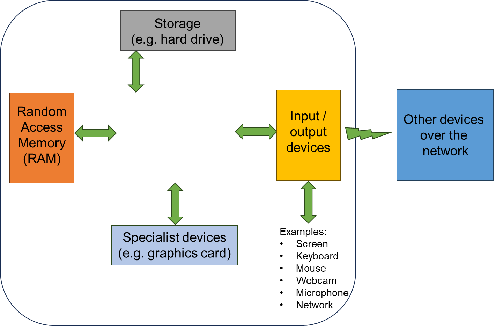

Formative quiz 1
================

Below is a quiz testing the learning points covered so far in the course. Responses are anonymous and there is no mark given to this. The questions give you an opportunity to test your knowledge before moving on to later parts of the course. 

If you get a low score, you may like to go back over some of the material, and do the quiz again, before moving on to the next week. You can submit as many times as you would like.

.. quizdown::

   #### The diagram below, showing the parts of a computer system, is missing a central part. What is this part?

   

   > See the lecture notes on [computer hardware](https://uom-eee-eeen11202.github.io/notes-part1/chapters/computer_hardware.html)

   1. [ ] The core
       > That's not correct. A core is part of a processor, but it's not a complete processor, and all computers need a processor.
   1. [ ] The soundcard
       > That's not correct. Most computers will have soundcards, allowing audio to be played, but they're not the central part of the computer drawn here.
   1. [ ] Touch input
       > That's not correct. Touch input is widely used in some computer systems, but it's not the central part of the computer drawn here.
   1. [x] The processor
       > That's correct!
   1. [ ] The cache
       > That's not correct. Cache is memory very local to the processor, typically on the same microchip. Cache is part of a processor, but it's not a complete processor, and all computers need a processor.

   #### Sustainability is an important to think about in programming.

   > See the lecture notes on [wider factors to consider](https://uom-eee-eeen11202.github.io/notes-part1/chapters/wider_factors.html)

   
   1. [x] True
       > That's correct! When starting out, we tend to focus on making programs that are functionally correct - ones that do what we want. Once they are working, there are a wide range of other factors, such as security and sustainability we may need to take into account. 
   1. [ ] False
       > That's not correct. Computer systems use large amounts of energy and water, and inefficient coding can waste lots of resources.

   ## What is the name of the Integrated Development Environment that we'll use in this course?

   1. [x] VSCode
   1. [ ] Visual Studio
   1. [ ] Xcode
   1. [ ] Eclipse
   1. [ ] Code blocks

   ## What is the function of static code analysis in an integrated development environment?

   1. [ ] To analyze code after it has executed to detect errors that occurred.
   1. [ ] To analyze code while it is running to debug and detect errors.
   1. [x] To analyze code before it is compiled to pre-detect potential errors.
   1. [ ] To analyze our requirements and generate code for us using generative artificial intelligence.
   1. [ ] To carry out all tasks listed here.

   ## What is meant by a conditional break point? 

   1. [ ] A line of code that changes the flow of the program
   1. [x] A debugger setting that pauses the program execution in certain cases
   1. [ ] A comment that explains which code is relevant to different situations
   1. [ ] An assert statement that stops the execution of the program when triggered
   1. [ ] A setting used to control when the code is checked into a version control repository

   ## What is meant by a conditional break point? 

   1. [x] VSCode
   1. [ ] Visual Studio
   1. [ ] Xcode
   1. [ ] Eclipse
   1. [ ] Code blocks

   ## What is meant by a conditional break point? 

   1. [x] VSCode
   1. [ ] Visual Studio
   1. [ ] Xcode
   1. [ ] Eclipse
   1. [ ] Code blocks

   ## What is meant by a conditional break point? 

   1. [x] VSCode
   1. [ ] Visual Studio
   1. [ ] Xcode
   1. [ ] Eclipse
   1. [ ] Code blocks

   ## What is meant by a conditional break point? 

   1. [x] VSCode
   1. [ ] Visual Studio
   1. [ ] Xcode
   1. [ ] Eclipse
   1. [ ] Code blocks

   ## What is meant by a conditional break point? 

   1. [x] VSCode
   1. [ ] Visual Studio
   1. [ ] Xcode
   1. [ ] Eclipse
   1. [ ] Code blocks

