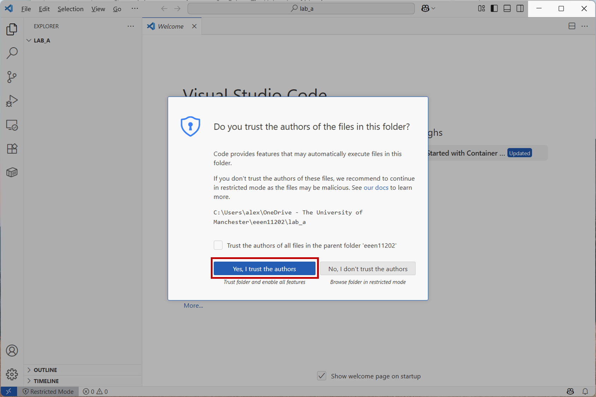
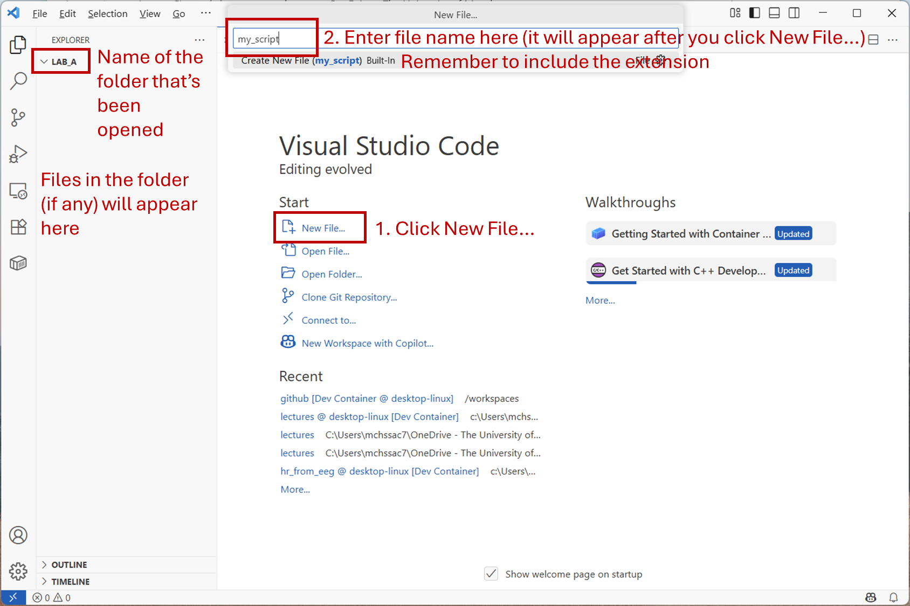
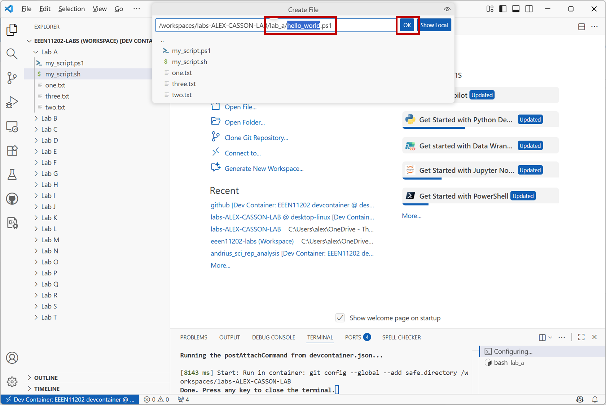
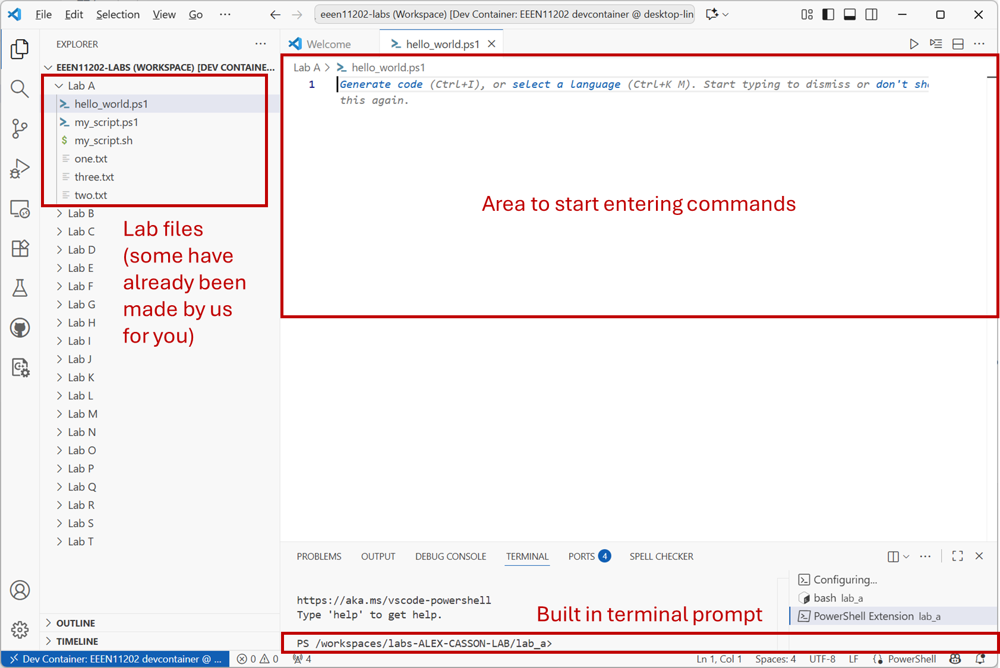

.. role:: console(code)
   :language: console

.. _lab_a1:

Shell scripting
===============

Setup
-----
`Follow the instructions for getting access to a suitable programming environment on your computer <https://uom-eee-eeen11202.github.io/chapters/getting_started/install.html>`_. If you have any difficulties, ask a demonstrator in a lab session for help.

You don't need to actually start VSCode yet. We're going to start using only the command line interface (also known as the terminal, shell, or console) that's built into your computer.

Launching the terminal
----------------------
On a desktop/laptop type device you will already have a command line interface installed. Start this, following the instructions given below for your operating system.

.. tab-set::
    :sync-group: os

    .. tab-item:: :fab:`windows` Windows
        :sync: key1

        The terminal is called *PowerShell*. You have a **choice** for how to start this. 
        
        #. You can start it directly by typing in :console:`powershell` to the search box in the start menu.

           .. figure:: ./images/windows_powershell_start.png
              :width: 800
              :align: center
              :alt: A Windows start menu search for the PowerShell app
           
              Screenshot of the Windows start menu and VSCode, software from `Microsoft <https://www.microsoft.com/>`_. See `course copyright statement <https://uom-eee-eeen11202.github.io/chapters/about/copyright>`_.

        #. Or, you can first install *Windows terminal*. Launch the *Microsoft Store* and search for :console:`terminal`. Then install *Windows Terminal*.

           Then launch it by typing in :console:`terminal` to the search box in the start menu.

           .. figure:: ./images/windows_terminal_start.png
              :width: 800
              :align: center
              :alt: A Windows start menu search for the terminal app

              Screenshot of the Windows start menu and VSCode, software from `Microsoft <https://www.microsoft.com/>`_. See `course copyright statement <https://uom-eee-eeen11202.github.io/chapters/about/copyright>`_.

        We think that Windows Terminal provides a slightly nicer interface (to exactly the same thing) and so our screenshots will make us of it.

    .. tab-item:: :fab:`apple` macOS / :fab:`linux` Linux
        :sync: key2

        Click on the launchpad / start icon for your operating system and then search for :console:`terminal`.

You should be presented with a terminal command line interface that looks like the below. Note that we've combined the instructions for macOS and Linux in the below, as these terminals will take the same commands and it reduces the number of pictures needed. The only meaningful difference at this point is that macOS uses :console:`%` to indicate where to enter commands, while Linux uses :console:`$` by default. Widows uses :console:`>` to show where to enter commands.

.. tab-set::
    :sync-group: os

    .. tab-item:: :fab:`windows` Windows
        :sync: key1

        .. figure:: ./images/windows_terminal.png
           :width: 800
           :align: center
           :alt: Windows terminal

           Screenshot of the Windows terminal, software from `Microsoft <https://www.microsoft.com/en-gb/windows>`_. See `course copyright statement <https://uom-eee-eeen11202.github.io/chapters/about/copyright>`_.

    .. tab-item:: :fab:`apple` macOS / :fab:`linux` Linux
        :sync: key2

        .. figure:: ./images/unix_terminal.png
           :width: 800
           :align: center
           :alt: macOS/Linux terminal

           Screenshot of the Windows terminal, software from `Microsoft <https://www.microsoft.com/en-gb/windows>`_. See `course copyright statement <https://uom-eee-eeen11202.github.io/chapters/about/copyright>`_.

Simple terminal commands
------------------------
There are a large number of different commands that you can enter at the prompt to interact with your computer. We'll go through some common examples below.

After a while you'll probably memorize some common ones, but in general you can look up or ask AI to help with any that you don't know. Important for this course isn't to memorize all of the different commands, but to have an understanding of how the command line works so that you can use it to interact with the computer.

Displaying the current folder
^^^^^^^^^^^^^^^^^^^^^^^^^^^^^
To display the `address of the current folder <https://uom-eee-eeen11202.github.io/notes-part1/chapters/computer_software/files_and_folders.html#file-systems>`_ type in

.. tab-set::
    :sync-group: os

    .. tab-item:: :fab:`windows` Windows
        :sync: key1

        .. prompt::
           :language: powershell

           Get-Location

        and press the :console:`Enter` key on the keyboard.
        
        Remember, you don't type in the :console:`>`, that just to show you where the command prompt is.

        This will display something like the below, where we've also shown how this appears in the Windows graphical interface.

        .. figure:: ./images/windows_get_location.png
           :width: 800
           :align: center
           :alt: Windows terminal showing the Get-Location command

           Screenshot of the Windows terminal and File Explorer, software from `Microsoft <https://www.microsoft.com/en-gb/windows>`_. See `course copyright statement <https://uom-eee-eeen11202.github.io/chapters/about/copyright>`_.

    .. tab-item:: :fab:`apple` macOS / :fab:`linux` Linux
        :sync: key2

        .. prompt::
           :language: bash
        
           pwd

        and press the :console:`Enter` key on the keyboard.
        
        Remember, you don't type in the :console:`$`, that just to show you where the command prompt is.

        :console:`pwd` stands for print working directory. This will display something like the below.

        .. figure:: ./images/unix_get_location.png
           :width: 800
           :align: center
           :alt: Unix terminal showing the pwd command

           Screenshot of the Windows terminal, software from `Microsoft <https://www.microsoft.com/en-gb/windows>`_. See `course copyright statement <https://uom-eee-eeen11202.github.io/chapters/about/copyright>`_.

The address shown will be different depending on your computer settings and user name. Here the user name is alex. You should be able to open File Explorer/Finder/similar and find the same location on your computer. It's not that you can't use the graphical interface to view this information, it's that entering written commands gives us precise control and a log of what we've done. If you press the up arrow :console:`↑` on the keyboard you can see previous commands that you've entered. Press it multiple times to see earlier commands. Or, enter 

.. tab-set::
    :sync-group: os

    .. tab-item:: :fab:`windows` Windows
        :sync: key1

        .. prompt::
           :language: powershell
        
           Get-History

    .. tab-item:: :fab:`apple` macOS / :fab:`linux` Linux
        :sync: key2

        .. prompt::
           :language: bash
        
           history

to see a log of all of the commands that you've run. This makes it easy to re-run them. 

Listing the files in the current folder
^^^^^^^^^^^^^^^^^^^^^^^^^^^^^^^^^^^^^^^
To get a list of the `files in the current folder <https://uom-eee-eeen11202.github.io/notes-part1/chapters/computer_software/files_and_folders.html#files>`_ type in

.. tab-set::
    :sync-group: os

    .. tab-item:: :fab:`windows` Windows
        :sync: key1

        .. prompt::
           :language: powershell
        
           Get-ChildItem

        and press the :console:`Enter` key on the keyboard.
        
        This will display something like 

        .. figure:: ./images/windows_ls.png
           :width: 800
           :align: center
           :alt: Windows terminal showing the Get-ChildItem command

           Screenshot of the Windows terminal and File Explorer, software from `Microsoft <https://www.microsoft.com/en-gb/windows>`_. See `course copyright statement <https://uom-eee-eeen11202.github.io/chapters/about/copyright>`_.

    .. tab-item:: :fab:`apple` macOS / :fab:`linux` Linux
        :sync: key2

        .. prompt::
           :language: bash

           ls

        and press the :console:`Enter` key on the keyboard.

        This will display something like 

        .. figure:: ./images/unix_ls.png
           :width: 800
           :align: center
           :alt: Unix terminal showing the ls command

           Screenshot of the Windows terminal, software from `Microsoft <https://www.microsoft.com/en-gb/windows>`_. See `course copyright statement <https://uom-eee-eeen11202.github.io/chapters/about/copyright>`_.

You may have different files, or none at all, displayed depending on what's on your computer in your current location. 

Again, you should be able to open File Explorer/Finder/similar and find the same location and files on your computer.

Folders
^^^^^^^
Make a folder called :console:`test` by entering the command

.. tab-set::
    :sync-group: os

    .. tab-item:: :fab:`windows` Windows
        :sync: key1

        .. prompt::
           :language: powershell

           New-Item -ItemType Directory -Path test

    .. tab-item:: :fab:`apple` macOS / :fab:`linux` Linux
        :sync: key2

        .. prompt::
           :language: bash
        
           mkdir test

Then move into the folder :console:`test` by entering the command

.. tab-set::
    :sync-group: os

    .. tab-item:: :fab:`windows` Windows
        :sync: key1

        .. prompt::
           :language: powershell

           Set-Location -Path test

    .. tab-item:: :fab:`apple` macOS / :fab:`linux` Linux
        :sync: key2

        .. prompt::
           :language: bash

           cd test

You can enter 

.. tab-set::
    :sync-group: os

    .. tab-item:: :fab:`windows` Windows
        :sync: key1

        .. prompt::
           :language: powershell
        
           Get-ChildItem

    .. tab-item:: :fab:`apple` macOS / :fab:`linux` Linux
        :sync: key2

        .. prompt::
           :language: bash
        
           ls

again to check the location. It should display something similar to 

.. tab-set::
    :sync-group: os

    .. tab-item:: :fab:`windows` Windows
        :sync: key1

        :console:`C:\\Users\\alex\\test`

    .. tab-item:: :fab:`apple` macOS / :fab:`linux` Linux
        :sync: key2

        :console:`/Users/alex/test`
        or
        :console:`/home/alex/test`

depending on the location you started from. You can go *up* a level, that is to exit the :console:`test` folder, by entering

.. tab-set::
    :sync-group: os

    .. tab-item:: :fab:`windows` Windows
        :sync: key1

        .. prompt::
           :language: powershell

           cd ..

    .. tab-item:: :fab:`apple` macOS / :fab:`linux` Linux
        :sync: key2

        .. prompt::
           :language: bash

           cd ..

Command switches
^^^^^^^^^^^^^^^^
Lots of commands accept options that change their behavior. These are known as *switches* or as *arguments*. Generally these are entered with a hyphen :console:`-` or two hyphens :console:`--` after the main command. Try entering

.. tab-set::
    :sync-group: os

    .. tab-item:: :fab:`windows` Windows
        :sync: key1

        .. prompt::
           :language: powershell

           Get-ChildItem -Attributes Directory

        This will display only folders, rather than everything that's in the current location.

    .. tab-item:: :fab:`apple` macOS / :fab:`linux` Linux
        :sync: key2

        .. prompt::
           :language: bash

           ls -la

        This lists the contents of the folder, together with additional information such as when the items were last changed. An example is below. What's shown will depend on what files and folders you have on your computer.

        .. figure:: ./images/unix_lsla.png
           :width: 800
           :align: center
           :alt: Example of output from ls -la

           Screenshot of the Windows terminal, software from `Microsoft <https://www.microsoft.com/en-gb/windows>`_. See `course copyright statement <https://uom-eee-eeen11202.github.io/chapters/about/copyright>`_.

Combining commands
^^^^^^^^^^^^^^^^^^
There are a number of ways in which you can combine togethers, for example to send the output of one command as the input to another command. Enter 

.. tab-set::
   :sync-group: os

   .. tab-item:: :fab:`windows` Windows
      :sync: key1

      .. prompt::
         :language: powershell

         Get-ChildItem | Out-File -FilePath list.txt

      This will take the output from :console:`Get-ChildItem` and write it to a text file called :console:`list.txt` rather than displaying it to the screen. You can read the contents of this file using 

      .. prompt::
         :language: powershell

         Get-Content -Path list.txt

   .. tab-item:: :fab:`apple` macOS / :fab:`linux` Linux
      :sync: key2

      .. prompt::
         :language: bash

         ls -la | tee list.txt

      This will take the output from :console:`ls -la` and write it to a text file called :console:`list.txt` rather than displaying it to the screen. You can read the contents of this file using 

      .. prompt::
         :language: bash

         cat list.txt

      .. admonition:: Aside
         :class: dropdown

         You can also use the redirection operator :console:`>>` for a similar effect, but we won't cover that here.

Further commands
^^^^^^^^^^^^^^^^
There are many further command line commands that come by default with your computer. Most apps you install can also be controlled from the command line, even if you usually use the graphical interface. We won't aim to cover these here, but you'll encounter many such commands as you move through the course. 

For now, spend a bit of time moving between folders using the commands given above to get a feeling for how it works. 

Scripts
-------
The above commands work very well when working *interactively* with the computer. That is, entering one command, observing the output, then entering the next command, and so on. 

Often we need to carry out more complex processes though, which might need lots of commands. We might want to run these multiple times, once a day for example to run a series of steps repeatedly. We can collect together shell commands into a *shell script* to help us with this. A shell script is a file containing a list of commands to be run one-after-another.

.. admonition:: Aside
   :class: dropdown

   You can probably accomplish the same automation, and more, using Python, which we'll meet later. However, for simple automation tasks that can be overkill. The shell commands are built into the operating system and so are always available. For simple automation tasks shell scripts are widely used. 

Getting started
^^^^^^^^^^^^^^^
`Follow the instructions to install the software needed for this course, and then to start VSCode following those instructions. <https://uom-eee-eeen11202.github.io/chapters/useful_information/install.html>`_

This will display the welcome page, and pre-downloaded files for Lab A, similar to the below. Remember that VSCode is very configurable. Don't worry if your screen isn't exactly the same, as long as it's broadly similar it will be fine.  

.. figure:: ./images/vscode_welcome_page.png
   :width: 800
   :align: center
   :alt: The VSCode welcome page

   Screenshot of VSCode, software from `Microsoft <https://code.visualstudio.com/>`_. See `course copyright statement <https://uom-eee-eeen11202.github.io/chapters/about/copyright>`_.

You may (but may not) be asked whether you trust the authors. This is a security setting. Letting code run on your computer can change settings, delete files, or do other nefarious things. It's our own code we're writing though, so select :console:`Yes, I trust the authors`.

   Screenshot of VSCode, software from `Microsoft <https://code.visualstudio.com/>`_. See `course copyright statement <https://uom-eee-eeen11202.github.io/chapters/about/copyright>`_.

You need to make a `file <https://uom-eee-eeen11202.github.io/notes-part1/chapters/computer_software/files_and_folders.html#files>`_ to store your shell script in. Click :console:`New File...`. This will display a box to enter the file name. 

   Screenshot of VSCode, software from `Microsoft <https://code.visualstudio.com/>`_. See `course copyright statement <https://uom-eee-eeen11202.github.io/chapters/about/copyright>`_.

Enter the filename as

.. tab-set::
    :sync-group: os

    .. tab-item:: :fab:`windows` Windows
        :sync: key1

        :console:`hello_world.ps1`

    .. tab-item:: :fab:`apple` macOS / :fab:`linux` Linux
        :sync: key2

        :console:`hello_world.sh`

You'll need to press :console:`Enter` on the keyboard. This will display another box confirming where you want the file stored. We want it in the Lab A folder, which should come up as the default location. Press :console:`OK`.

   Screenshot of VSCode, software from `Microsoft <https://code.visualstudio.com/>`_. See `course copyright statement <https://uom-eee-eeen11202.github.io/chapters/about/copyright>`_.

Due to our VSCode setup, where each Lab is stored as a separate *workspace*, VSCode will ask you which lab you want the script to be associated with. Select Lab A. 

.. figure:: ./images/vscode_select_workspace.png
   :width: 800
   :align: center
   :alt: VSCode selecting workspace to use for the lab

   Screenshot of VSCode, software from `Microsoft <https://code.visualstudio.com/>`_. See `course copyright statement <https://uom-eee-eeen11202.github.io/chapters/about/copyright>`_.

Once successful, you'll see the :console:`hello_world` file in VSCode. You'll have an area to start adding your shell commands to, as shown below. (This figure assumes you're using Windows, so the script has a :console:`.ps1` extension).

   Screenshot of VSCode, software from `Microsoft <https://code.visualstudio.com/>`_. See `course copyright statement <https://uom-eee-eeen11202.github.io/chapters/about/copyright>`_.

A simple script
^^^^^^^^^^^^^^^
In your file, enter the code below. (It's fine to just copy and paste this.)

.. tab-set::
   :sync-group: os

   .. tab-item:: :fab:`windows` Windows
      :sync: key1

      .. code-block:: console
           
         # Display a welcome message
         $name = "Alex"
         Write-Host "Hello $name!"

         # Display a different message depending on the value of $hour
         $hour = 13
         if ($hour -ge 12) {
             Write-Host "It is the afternoon."
         } else {
             Write-Host "It is the morning."
         }
        
      This is a very simple script. It:
        
      - Contains some `comments <https://uom-eee-eeen11202.github.io/notes-part1/chapters/software_development_tools/comments.html>`_, lines starting with :console:`#` to explain what's going on.
      - `Variables <https://uom-eee-eeen11202.github.io/notes-part1/chapters/programming_fundamentals/variables.html>`_ to store data in. In Powershell, variables start with a :console:`$`. 
      - :console:`Write-Host` is used to display output to the screen. 
      - There is then an `if statement <https://uom-eee-eeen11202.github.io/notes-part1/chapters/programming_fundamentals/conditionals_and_loops.html#if-else-statements>`_ to change what's displayed depending on the value of :console:`$hour`. Here :console:`-ge` means greater than or equal to.

   .. tab-item:: :fab:`apple` macOS / :fab:`linux` Linux
      :sync: key2

      .. code-block:: console
           
         #!/usr/bin/env sh

         # Display a welcome message
         name="Alex"
         echo "Hello $name!"

         # Display a different message depending on the value of $hour
         hour=13
         if [ "$hour" -ge 12 ]; then
             echo "It is the afternoon."
         else 
             echo "It is the morning."
         fi
        
      This is a very simple script.
        
      - The line starting :console:`#!` is known as a *shebang line*. This tells the computer which language to use to interpret the script. You may well have more than one installed. The :console:`sh` tells the computer to use whatever the system default is. 
      - There are then some `comments <https://uom-eee-eeen11202.github.io/notes-part1/chapters/software_development_tools/comments.html>`_, lines starting with :console:`#` to explain what's going on.
      - `Variables <https://uom-eee-eeen11202.github.io/notes-part1/chapters/programming_fundamentals/variables.html>`_ store data. Here variables start with a :console:`$` when being used, but the :console:`$` isn't needed when putting a value in the console. 
      - :console:`echo` is used to display output to the screen. 
      - There is then an `if statement <https://uom-eee-eeen11202.github.io/notes-part1/chapters/programming_fundamentals/conditionals_and_loops.html#if-else-statements>`_ to change what's displayed depending on the value of :console:`$hour`. Here :console:`-ge` means greater than or equal to.

Save the file by selecting :console:`File / Save`.

Running the script
^^^^^^^^^^^^^^^^^^
To run the script, you have two options. Both options do exactly the same thing, just one method is built into VSCode and one method is built into the computer's command line. 

.. tab-set::
    :sync-group: os

    .. tab-item:: :fab:`windows` Windows
        :sync: key1

        Option 1. Press the run button that appears in the VSCode GUI. This will run the script, and you'll see appropriate text in the terminal, as shown below.

        .. figure:: ./images/vscode_run_script.png
           :width: 800
           :align: center
           :alt: VSCode run button

           Screenshot of VSCode, software from `Microsoft <https://code.visualstudio.com/>`_. See `course copyright statement <https://uom-eee-eeen11202.github.io/chapters/about/copyright>`_.

        Option 2. In a Powershell terminal on the computer enter the command

        .. prompt::
           :language: powershell

           powershell.exe -noprofile -executionpolicy bypass -file .\hello_world.ps1

        :console:`.\\hello_world.ps1` is a `relative address <https://uom-eee-eeen11202.github.io/notes-part1/chapters/computer_software/files_and_folders.html#absolute-vs-relative-addresses>`_. It assumes your terminal is in the same folder as the script. 

        .. figure:: ./images/terminal_run_script.png
           :width: 800
           :align: center
           :alt: Running a PowerShell script in the terminal

           Screenshot of the Windows terminal, software from `Microsoft <https://www.microsoft.com/en-gb/windows>`_. See `course copyright statement <https://uom-eee-eeen11202.github.io/chapters/about/copyright>`_.

        By default, Windows blocks users from running arbitrary scripts for security reasons. The extra commands above tell Windows to ignore the security settings for this run of the script. This is fine for this lab, but of course you should take care when running scripts from others. You can change the Windows security settings so you don't need to give an override each time, but we won't cover that here.

    .. tab-item:: :fab:`apple` macOS / :fab:`linux` Linux
        :sync: key2

        Option 1. In the VSCode terminal enter the commands

        .. prompt::
           :language: bash

           chmod u+x ./hello_world.sh
           ./hello_world.sh

        .. figure:: ./images/vscode_run_script_unix.png
           :width: 800
           :align: center
           :alt: VSCode run button

           Screenshot of VSCode, software from `Microsoft <https://code.visualstudio.com/>`_. See `course copyright statement <https://uom-eee-eeen11202.github.io/chapters/about/copyright>`_.

        Option 2. In a computer terminal enter the commands

        .. prompt::
           :language: bash

           chmod u+x ./hello_world.sh
           ./hello_world.sh

        .. figure:: ./images/terminal_run_script_unix.png
           :width: 800
           :align: center
           :alt: Running a PowerShell script in the terminal

           Screenshot of the Windows terminal, software from `Microsoft <https://www.microsoft.com/en-gb/windows>`_. See `course copyright statement <https://uom-eee-eeen11202.github.io/chapters/about/copyright>`_.

        In both cases, :console:`chmod u+x` changes the security settings, allowing the script to be run (executed :console:`x`) by the user (:console:`u`). You only need to set this once for each file, then the setting will be remembered. :console:`./hello_world.sh` actually runs the code. 
        
        :console:`./hello_world.sh` is a `relative address <https://uom-eee-eeen11202.github.io/notes-part1/chapters/computer_software/files_and_folders.html#absolute-vs-relative-addresses>`_. It assumes your terminal is in the same folder as the script. 

Try changing the values of :console:`$name` and :console:`$hour` and re-run the script to check it displays what you would expect. 

As a challenge, get your script to automatically read the system time to determine which message to display. That is, rather than typing in a value for :console:`$hour`, use a command to set it for you. On Windows, read about the :console:`Get-Date` command. On macOS/Linux, read about the :console:`date` command. These give full dates by default, you'll need to add some switches for them to return only the current hour. Search the Internet or ask a chat bot for the options to provide.

.. admonition:: Solution
   :class: dropdown

   .. tab-set::
      :sync-group: os

      .. tab-item:: :fab:`windows` Windows
         :sync: key1

         .. code-block:: console
            
            # Display a welcome message
            $name = "Alex"
            Write-Host "Hello $name!"

            # Display a different message depending on the value of $hour
            $hour = Get-Date -Format HH
            if ($hour -ge 12) {
                Write-Host "It is the afternoon."
            } else {
                Write-Host "It is the morning."
            }

      .. tab-item:: :fab:`apple` macOS / :fab:`linux` Linux
         :sync: key2

         .. code-block:: console

            #!/usr/bin/env sh

            # Display a welcome message
            name="Alex"
            echo "Hello $name!"

            # Display a different message depending on the value of $hour
            hour="$(date +"%H")"
            if [ "$hour" -ge 12 ]; then
                echo "It is the afternoon."
            else 
                echo "It is the morning."
            fi

More scripts
^^^^^^^^^^^^
Many of the programming concepts introduced in Part 1, such as `loops <https://uom-eee-eeen11202.github.io/notes-part1/chapters/programming_fundamentals/conditionals_and_loops.html>`_ and `different data types <https://uom-eee-eeen11202.github.io/notes-part1/chapters/programming_fundamentals/data_types.html>`_ are possible in shell scripts if you need them. (Although if you're doing much more than simple computer automation you're likely better to use Python, as we'll learn about later in the course.) 

At the end of your script file from above add the code 

.. tab-set::
   :sync-group: os

   .. tab-item:: :fab:`windows` Windows
      :sync: key1

      .. code-block:: console

         # Display colours of the rainbow
         $colors = @("Red","Orange","Yellow","Green","Blue","Indigo","Violet")
         For ($i=0; $i -lt $colors.Length; $i++) {
             Write-Host $colors[$i]
         }

         # Display the contents of / 
         Get-ChildItem -Path / | ForEach-Object {
             Write-Host "$_"
         }

      Save the file and press the :console:`Run` button again. You should have an output like the below.

      .. figure:: ./images/vscode_loop_windows.png
         :width: 800
         :align: center
         :alt: Example of for loops in a Windows shell script

         Screenshot of VSCode, software from `Microsoft <https://code.visualstudio.com/>`_. See `course copyright statement <https://uom-eee-eeen11202.github.io/chapters/about/copyright>`_.

      This script now contains two different types of :console:`for` loop.

      1. The first has a list of colours. Each of these colours is accessed in turn, and :console:`Write-Host` is used to display them to the screen. 

      2. The second uses :console:`ForEach-Object`, and takes its input from :console:`Get-ChildItem`. That is, it looks up what what is in the folder asked for. The results are passed to the for loop, so that each item can be used in turn, with the name of each item automatically stored in :console:`$_`. In the for loop, here we just display the name of each time. You could imagine carrying out more tasks, such as changing the name of files, or checking whether a file contains particular text, and so on. You would just add more lines of code between the curly brackers :console:`{}` of the :console:`ForEach-Object` command. 

      .. admonition:: Aside
         :class: dropdown
      
         You'll notice the code above displays the contents of :console:`/`, not :console:`C:\\`. This is because for the screenshots its being run in the devcontainer, which is a Linux environment. If you run it on your own Windows computer you'll want to display the contents of :console:`C:\\` instead.

   .. tab-item:: :fab:`apple` macOS / :fab:`linux` Linux
      :sync: key2

      .. code-block:: console

         # Display colours of the rainbow
         set -- "Red" "Orange" "Yellow" "Green" "Blue" "Indigo" "Violet"
         for a in "$@"; do 
           echo $a
         done

         # Display the contents of /
         for f in /*; do
           echo "/ contains $f"
         done

      Save the file and run the script again. You should have an output like the below.

      .. figure:: ./images/vscode_loop_unix.png
         :width: 800
         :align: center
         :alt: Example of for loops in a shell script

         Screenshot of VSCode, software from `Microsoft <https://code.visualstudio.com/>`_. See `course copyright statement <https://uom-eee-eeen11202.github.io/chapters/about/copyright>`_.

      This script now contains two different types of :console:`for` loop.

      1. The first has a list of colours, stored using :console:`set` into a variable called :console:`$@`. Each of these colours is accessed in turn and put into a variable called :console:`$a`. :console:`echo` is used to display :console:`$a` to the screen. 

      2. The second uses :console:`/*` to find all of the files that are stored in :console:`/`. :console:`*` indicates find everything. These are put into a variable called :console:`$f`, and :console:`echo` is used to display :console:`$f` to the screen. 
      
      .. admonition:: Aside
         :class: dropdown

         The above syntax, in particular the :console:`set` command is slightly awkward. Recall that our shebang line is :console:`#!/usr/bin/env sh`, to use the system's default terminal. As we don't necessarily know what the default will be, we're restricted to a small set of commands that we know will work in every shell. There is a standard known as POSIX which defines this. For most Linux systems the default shell is bash, and so we could use :console:`#!/usr/bin/env bash` as the shebang line. The macOS the default shell is zsh, and so :console:`#!/usr/bin/env zsh`. Doing this allows many more commands and a much nicer array syntax. However, it would mean our code was no longer portable, able to run on any system. As we don't know what computer you're using, we went for the fully portable option. 

There are of course many more possible commands and things that you can investigate. That's not our aim here. Our aim is to give you a brief introduction and some insights into what's possible, so you can then build on this if you need to, or if you encounter shell scripts in your future work. 

If you are having any issues writing or running the code, we've pre-made scripts called :console:`my_script.ps1` and :console:`my_script.sh` which contain the final code for this part of the lab. These were automatically downloaded to your Lab A folder as part of the VSCode setup. Have a look at these and use them to help debug or fix your code.