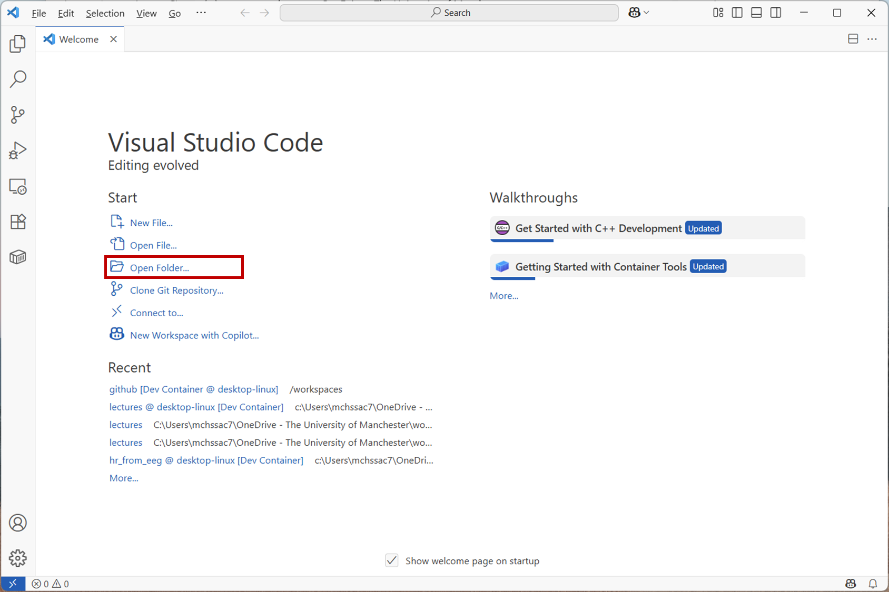
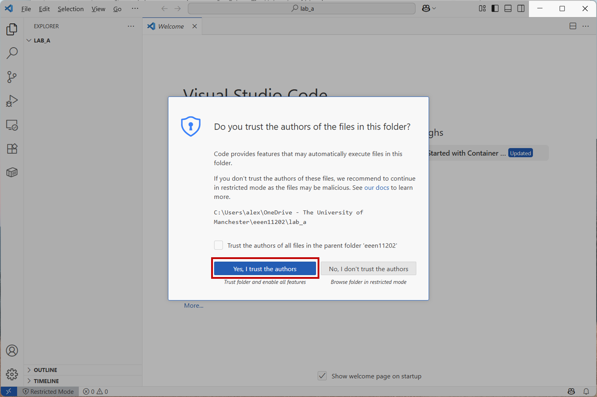
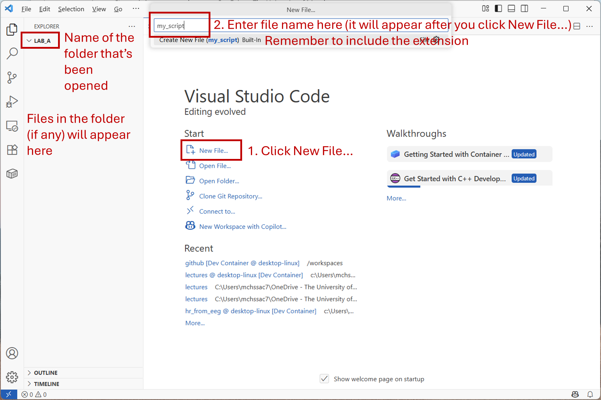
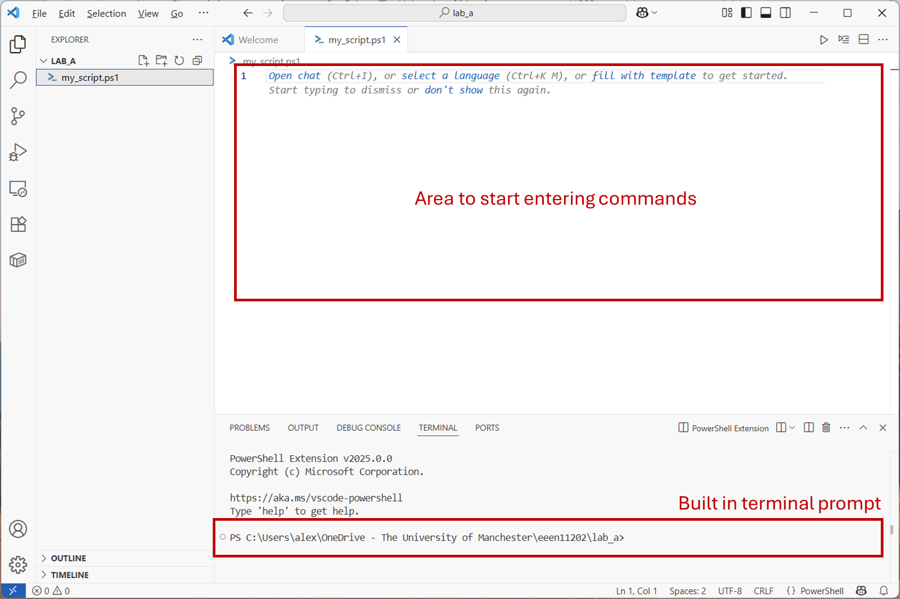

.. role:: console(code)
   :language: console

Stage 1
=======

We'll start with a tutorial. Work your way through the steps below. 

Launching the terminal
----------------------
On a desktop/laptop type device you will already have a command line interface installed. Start this, following the instructions given below for your operating system.

.. tab-set::
    :sync-group: os

    .. tab-item:: :fab:`windows` Windows
        :sync: key1

        The terminal is called *PowerShell*. You have a **choice** for how to start this. 
        
        (1) You can start it directly by typing in :console:`powershell` to the search box in the start menu.

        .. figure:: windows_powershell_start.png
           :width: 800
           :align: center
           :alt: A Windows start menu search for the PowerShell app

        (2) You can first install *Windows terminal*. Launch the *Microsoft Store* and then search for :console:`terminal`. Then install *Windows Terminal*.

        .. figure:: windows_terminal_store.png
           :width: 800
           :align: center
           :alt: The Microsoft Store for installing Windows Terminal

        Then launch it by typing in :console:`terminal` to the search box in the start menu.

        .. figure:: windows_terminal_start.png
           :width: 800
           :align: center
           :alt: A Windows start menu search for the terminal app

        We think that Windows Terminal provides a slightly nicer interface (to exactly the same thing) and so our screenshots will make us of it.

    .. tab-item:: :fab:`apple` macOS / :fab:`linux` Linux
        :sync: key2

        Click on the launchpad / start icon for your operating system and then search for :console:`terminal`.

You should be presented with a terminal command line interface that looks like the below. Note that we've combined the instructions for macOS and Linux in the below, as these terminals will take the same commands and it reduces the number of pictures needed. The only meaningful difference at this point is that macOS uses :console:`%` to indicate where to enter commands, while Linux uses :console:`$` by default. Widows uses :console:`>` to show where to enter commands.

.. tab-set::
    :sync-group: os

    .. tab-item:: :fab:`windows` Windows
        :sync: key1

        .. figure:: windows_terminal.png
           :width: 800
           :align: center
           :alt: Windows terminal

    .. tab-item:: :fab:`apple` macOS / :fab:`linux` Linux
        :sync: key2

        .. figure:: unix_terminal.png
           :width: 800
           :align: center
           :alt: macOS/Linux terminal

Simple terminal commands
------------------------
There are then a large number of different commands that you can enter at the prompt to interact with your computer. After a while you'll probably memorize some common ones, but in general you can look up or ask AI to help with any that you don't know. Important here isn't to memorize all of the different commands, but to have an understanding of how the command line works so that you can use it to interact with the computer.

Displaying the current folder
^^^^^^^^^^^^^^^^^^^^^^^^^^^^^
To display the `address of the current folder <https://uom-eee-eeen11202.github.io/notes-part1/chapters/computer_software/files_and_folders.html#file-systems>`_ enter

.. tab-set::
    :sync-group: os

    .. tab-item:: :fab:`windows` Windows
        :sync: key1

        :console:`> Get-Location`

        Remember, you don't type in the :console:`>`, that just to show you where the command prompt is.

        This will display something like 

        .. figure:: windows_get_location.png
           :width: 800
           :align: center
           :alt: Windows terminal showing the Get-Location command

    .. tab-item:: :fab:`apple` macOS / :fab:`linux` Linux
        :sync: key2

        :console:`$ pwd`

        Remember, you don't type in the :console:`$`, that just to show you where the command prompt is.

        :console:`$ pwd` stands for print working directory. This will display something like 

        .. figure:: unix_get_location.png
           :width: 800
           :align: center
           :alt: Unix terminal showing the pwd command

The address shown will be different depending on your computer settings and user name. Here the user name is alex. You should be able to open File Explorer/Finder/similar and find the same location on your computer. 

It's not that you can't use the graphical interface to view this, it's that entering written commands gives us precise control and a log of what we've done. If you press the up arrow :console:`↑` on the keyboard you can see previous commands that you've entered. Press it multiple times to see earlier commands. Or, enter 

.. tab-set::
    :sync-group: os

    .. tab-item:: :fab:`windows` Windows
        :sync: key1

        :console:`> Get-History`

    .. tab-item:: :fab:`apple` macOS / :fab:`linux` Linux
        :sync: key2

        :console:`$ history`

to see a log of all of the commands that you've run. This makes it easy to re-run them. 

Listing the files in the current folder
^^^^^^^^^^^^^^^^^^^^^^^^^^^^^^^^^^^^^^^
To get a list of the `files in the current folder <https://uom-eee-eeen11202.github.io/notes-part1/chapters/computer_software/files_and_folders.html#files>`_ enter

.. tab-set::
    :sync-group: os

    .. tab-item:: :fab:`windows` Windows
        :sync: key1

        :console:`> Get-ChildItem`
        
        This will display something like 

        .. figure:: windows_ls.png
           :width: 800
           :align: center
           :alt: Windows terminal showing the Get-ChildItem command

    .. tab-item:: :fab:`apple` macOS / :fab:`linux` Linux
        :sync: key2

        :console:`$ ls`

        This will display something like 

        .. figure:: unix_ls.png
           :width: 800
           :align: center
           :alt: Unix terminal showing the ls command

Again, you should be able to open File Explorer/Finder/similar and find the same location on your computer.

Folders
^^^^^^^
Make a folder called :console:`test` by entering the command

.. tab-set::
    :sync-group: os

    .. tab-item:: :fab:`windows` Windows
        :sync: key1

        :console:`> New-Item -ItemType Directory -Path test`

    .. tab-item:: :fab:`apple` macOS / :fab:`linux` Linux
        :sync: key2

        :console:`$ mkdir test`

Then move into the folder :console:`test` by entering the command

.. tab-set::
    :sync-group: os

    .. tab-item:: :fab:`windows` Windows
        :sync: key1

        :console:`> Set-Location -Path test

    .. tab-item:: :fab:`apple` macOS / :fab:`linux` Linux
        :sync: key2

        :console:`$ cd test`

You can enter 

.. tab-set::
    :sync-group: os

    .. tab-item:: :fab:`windows` Windows
        :sync: key1

        :console:`> Get-ChildItem`

    .. tab-item:: :fab:`apple` macOS / :fab:`linux` Linux
        :sync: key2

        :console:`$ ls`

again to check the location. It should display something similar to 

.. tab-set::
    :sync-group: os

    .. tab-item:: :fab:`windows` Windows
        :sync: key1

        :console:`C:\Users\alex\test`

    .. tab-item:: :fab:`apple` macOS / :fab:`linux` Linux
        :sync: key2

        :console:`/Users/alex/test`
        or
        :console:`/home/alex/test`

depending on the location you started from. You can go *up* a level, that is to exit the :console:`test`, by entering

.. tab-set::
    :sync-group: os

    .. tab-item:: :fab:`windows` Windows
        :sync: key1

        :console:`cd ..`

    .. tab-item:: :fab:`apple` macOS / :fab:`linux` Linux
        :sync: key2

        :console:`cd ..`

Command switches
^^^^^^^^^^^^^^^^
Lots of commands accept options that change their behavior. These are known as switches or as arguments. Generally these are entered with a hyphen :console:`-` or two hyphens :console:`--` after the main command. Try entering

.. tab-set::
    :sync-group: os

    .. tab-item:: :fab:`windows` Windows
        :sync: key1

        :console:`Get-ChildItem -Attributes Directory`

        This will display only folders, rather than everything that's in the current location.

    .. tab-item:: :fab:`apple` macOS / :fab:`linux` Linux
        :sync: key2

        :console:`ls -la`

        This lists the contents of the folder, together with additional information such as when the items were last changed. 

Combining commands
^^^^^^^^^^^^^^^^^^
There are a number of ways in which you can combine togethers, for example to send the output of one command as the input to another command. Enter 

.. tab-set::
    :sync-group: os

    .. tab-item:: :fab:`windows` Windows
        :sync: key1

        :console:`Get-ChildItem | Out-File -FilePath list.txt`

        This will take the output from :console:`Get-ChildItem` and write it to a text file called :console:`list.txt` rather than displaying it to the screen. You can read the contents of this file using 

        :console:`Get-Content -Path list.txt`

    .. tab-item:: :fab:`apple` macOS / :fab:`linux` Linux
        :sync: key2

        :console:`ls -la | tee list.txt`

         This will take the output from :console:`ls -la` and write it to a text file called :console:`list.txt` rather than displaying it to the screen. You can read the contents of this file using 

        :console:`cat list.txt`

        (You can also use the redirection operator :console:`>>` for a similar effect, but we won't cover that here.)

Further commands
^^^^^^^^^^^^^^^^
There are many further command line commands that come by default with your computer. Most apps you install can also be controlled from the command line, even if you usually use the graphical interface. We won't aim to cover these here, but you'll encounter many such commands as you move through the course. 

For now, spend a bit of time moving between folders using the commands given above to get a feeling for how it works. 

Shell scripts
-------------
The above commands work very well when working *interactively* with the computer. That is, entering one command, observing the output, then entering the next command; and so on. 

Often we need to carry out more complex processes though, which might need lots of commands. We might want to run these multiple times, once a day for example to run a series of steps repeatedly. We can collect together shell commands into a *shell script* to help us with this. A shell script is a file containing a list of commands to be run one-after-another.

.. admonition:: Aside

   You can probably accomplish the same automation, and more, using Python, which we'll meet later. However, for simple automation tasks that can be overkill. The shell commands are built into the operating system and so are always available. For simple automation tasks shell scripts are widely used. 

Simple scripts
^^^^^^^^^^^^^^

Make a folder called :console:`eeen11202` to store your work for the course. Make a folder called :console:`lab_a` inside this. 

.. tab-set::
    :sync-group: os

    .. tab-item:: :fab:`windows` Windows
        :sync: key1

        You can do this using the Windows interface, or using the commands given in the previous section. 
        
        We suggest you put this at :console:`C:\Users\alex\OneDrive - The University of Manchester\eeen11202\lab_a` (using the equivalent for your username and OneDrive. This will mean your files are automatically backed up and will be available on any computer where you're logged in to OneDrive.) This will look similar to the below.

        .. figure:: windows_folder_structure.png
           :width: 800
           :align: center
           :alt: File explorer showing the asked for folders

    .. tab-item:: :fab:`apple` macOS / :fab:`linux` Linux
        :sync: key2

         You can do this using the graphical interface, or using the commands given in the previous section. 
         
         We suggest you put this at :console:`/Users/alex/OneDrive - The University of Manchester/eeen11202/lab_a` or :console:`/home/alex/OneDrive - The University of Manchester/eeen11202/lab_a` (using the equivalent for your username and OneDrive. This will mean your files are automatically backed up and will be available on any computer where you're logged in to OneDrive.)

Start VSCode. This will display the welcome page, similar to the below. Remember that VSCode is very configurable. Don't worry if your screen isn't exactly the same, as long as it's broadly similar it will be fine.  

Click on :console:`Open Folder...` and select the :console:`lab_a` folder that you made in the previous step. You will be asked whether you trust the authors of this folder. This is a security setting, letting code run on your computer can change settings, delete files, or do other nefarious things. It's our own code we're writing though, so select :console:`Yes, I trust the authors`.

You'll see that the :console:`lab_a` folder has been opened, but it may not contain any files yet. (See figure below.) To make a file to store your shell script, click :console:`New File...`. This will display a box to enter the file name. Enter the filename as

.. tab-set::
    :sync-group: os

    .. tab-item:: :fab:`windows` Windows
        :sync: key1

        :console:`my_script.ps1`

    .. tab-item:: :fab:`apple` macOS / :fab:`linux` Linux
        :sync: key2

        :console:`my_script.sh`

You'll need to press :console:`Enter` on the keyboard, and then :console:`Create File` in the dialogue box that appears.

Once successful, you'll have an area to start adding your shell commands to, as shown below. (This figure assumes you're using Windows, so the script has a :console:`.ps1` extension).

