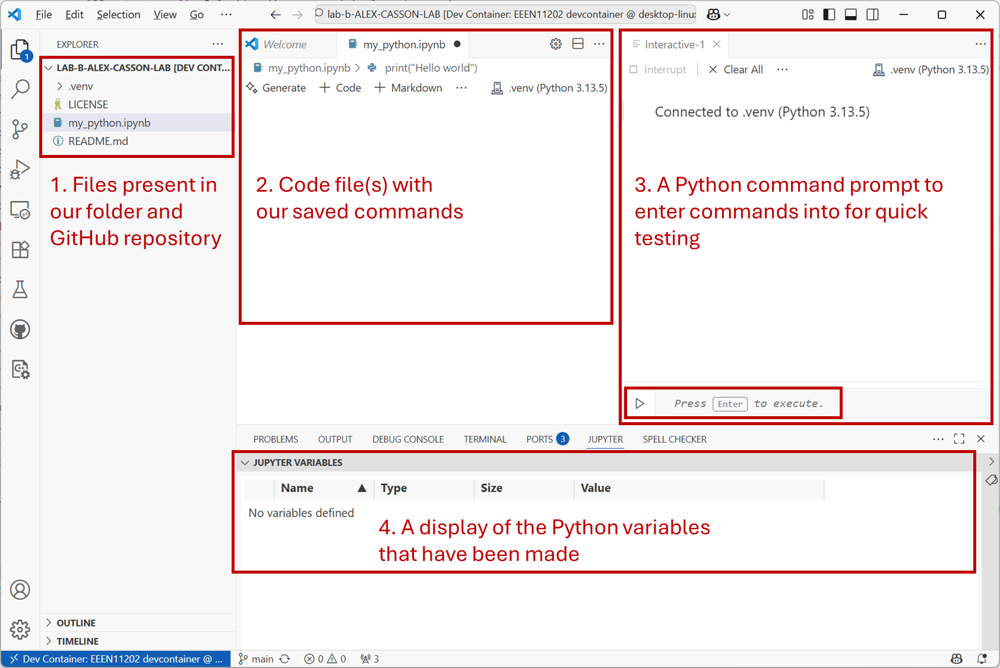
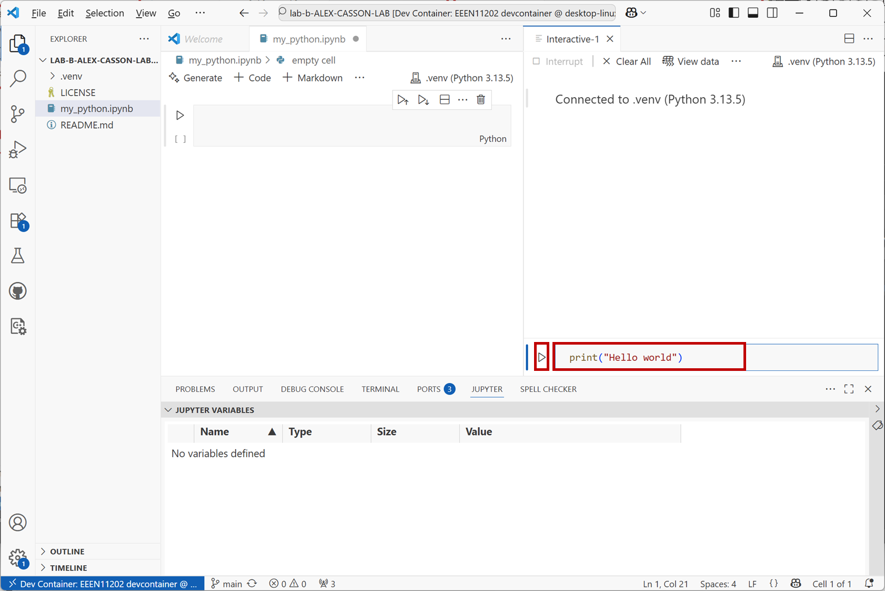
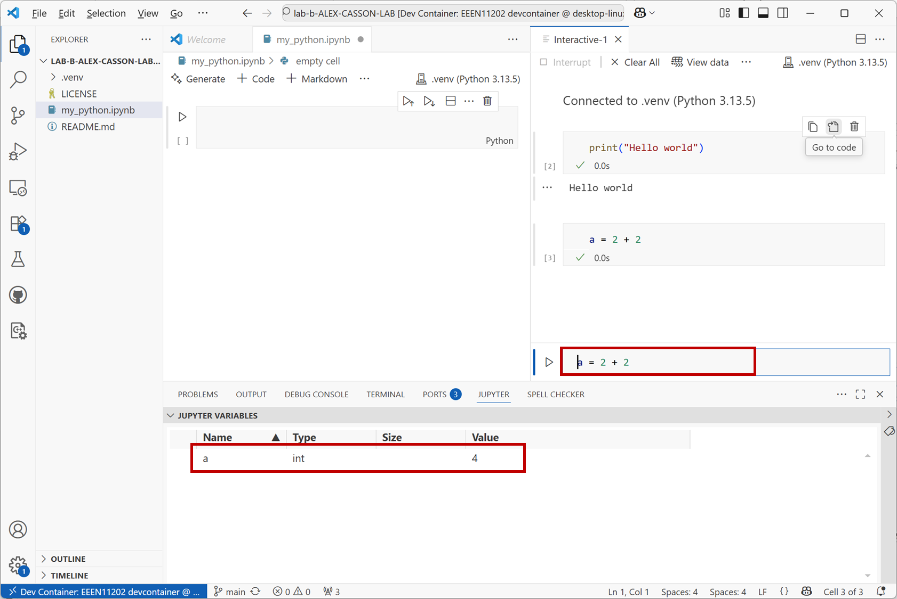

.. role:: console(code)
   :language: console

.. role:: python(code)
   :language: python

.. _lab_b1:

Python getting started
======================

.. _starting_the_environment:

Starting the programming environment
------------------------------------

We're going to use VSCode as we set up in :ref:`Lab A <vscode_setup>`. The course expects you to be using our setup, which includes a `devcontainer. <https://uom-eee-eeen11202.github.io/notes-part1/chapters/software_development_tools/environment_control.html>`_ to ensure everyone is using the same versions of the tools. You thus need to start VSCode the correct way to ensure that the settings are picked up correctly. You already did this in :ref:`Lab A <vscode_setup>`, but we'll repeat the steps here. It can be a bit fiddly at first, as you have to follow the steps or things won't work. You quickly get used to it though. 

#. The Github Classroom link for Lab B is:

   .. admonition:: GitHub Classroom link

      `<https://classroom.github.com/a/9GlbpVqE>`_

   Follow this link.
   
#. Click on :console:`Accept assignment`.

   .. figure:: ./images/github_accept_lab_b.png
      :width: 300
      :align: center
      :alt: GitHub a accept assignment page	

   You'll need to be signed in to GitHub for this to work. You should have already made a GitHub account in :ref:`Lab A <lab_a>`. If you haven't, follow the instructions :ref:`there again <version_control>` to make an account and get to the :console:`Accept assignment` button.
   
#. Once you've accepted the assignment, you'll be taken to a :console:`You're ready to go!` page, as shown below. 

   .. figure:: ./images/github_ready.png
      :width: 800
      :align: center
      :alt: The GitHub ready to go page

   This includes a web address. **Make a note of this, as you'll need it later.** It will be something like `https://github.com/UOM-EEE-EEEN11202-LABS/lab-b-ALEX-CASSON-LAB`. Your address will be individual to you, depending on what your GitHub username is.

#. Open Docker using the start menu (or equivalent for your operating system).

#. Open VSCode using the start menu (or equivalent for your operating system).

#. Click on :console:`Open Folder...` on the welcome screen, or press :console:`File` to see the same option. 

   .. figure:: ./images/vscode_open_folder.png
      :width: 800
      :align: center
      :alt: The VSCode welcome page

#. Navigate to the :console:`eeen11202` folder that you made in :ref:`Lab A <make_onedrive_folder>`. This should be in your OneDrive folder. It should contain a folder called :console:`.devcontainer`, and folders for whichever labs you've completed so far. If you don't see the :console:`.devcontainer` folder, you're either in the wrong place, or you need to go back to the :ref:`setup parts of Lab A <vscode_setup>` and make sure you've been through the steps there. You won't see a :console:`lab_b` folder yet, as we've not yet downloaded it.

   When you're in the correct folder, click :console:`Select Folder`. 

   .. figure:: ./images/vscode_opening_lab_b.png
      :width: 800
      :align: center
      :alt: Selecting the devcontainer folder in VSCode

#. The devcontainer may open automatically, in which case the button in the bottom left hand corner will say :console:`Dev Container`. If it is, skip to the next step. If not, click on the blue button and select :console:`Reopen in Container`. You may also get a pop-up that appears in the bottom right that gives you this options. Clicking either is fine.

   .. figure:: ./images/vscode_reopen_in_container.png
      :width: 800
      :align: center
      :alt: The VSCode devcontainer button
   
   Make sure that you've started Docker before this step, or it will fail and you'll have to do it again. 

#. You should see :console:`Dev Container` in the bottom left hand corner to show that you're working in the devcontainer rather than on your local computer. You can then click on :console:`Clone Git Repository...`

   .. figure:: ./images/vscode_clone_git_repo.png
      :width: 800
      :align: center
      :alt: The VSCode clone git repository option

#. Enter :console:`/workspaces/eeen11202` as the repository destination. :console:`/workspaces/eeen11202` is the location that both your computer and the devcontainer can access. If you put the files elsewhere, the it will work, but only the devcontainer will be able to see the files. Then click :console:`Select as Repository Destination`. Note you may need to press this twice.

   .. figure:: ./images/vscode_select_repository_destination.png
      :width: 800
      :align: center
      :alt: The VSCode clone repository destination

#. Done correctly, you'll see that the :console:`lab_b` starter files have been added to the list of files, and be given the option to open the folder. Click on :console:`Open`.

   .. figure:: ./images/vscode_open_last_step.png
      :width: 800
      :align: center
      :alt: VSCode open the repository folder.

#. Finally, you'll have a view like the below. This will show only the :console:`lab_b` files. You're then ready to go.

   .. figure:: ./images/vscode_lab_b_files.png
      :width: 800
      :align: center
      :alt: The lab files correctly opened in VSCode

Making a virtual environment
----------------------------
Before we can start programming we first need to make a :ref:`virtual environment <virtual_environments>`. In Lab C we'll make a Python *project* which automates some of this process for us. For this first Python lab however we'll do it by hand to give you the experience. Using a Python project is best practice, but you'll find lots of examples on the Internet that give you instructions to install things manually, and so we'll give you some examples of this here. 

We make a virtual environment at the command line, as we used in :ref:`Lab A <lab_1a>`. We're not using Python yet! The command prompt in the terminal will look like :console:`$` rather than :console:`>>>`. :console:`$` is the computer's command prompt, while :console:`>>>` is the Python command prompt.

   .. admonition:: Aside

      There are multiple different ways of making a virtual environment. You may see examples on the Internet using :console:`$ python -m venv .venv` or :console:`conda create --name .venv`. We're going to use an approach with :console:`uv`. If you see instructions using a different approach, they all have similar commands that are fairly intuitive to map between different tools.

#. In the VSCode terminal enter:

   .. code-block:: console

      $ uv venv .venv

   This will make a new virtual environment. It's called :console:`.venv`. The files are stored in the current folder together with your code files, but in general you shouldn't need to look at them. They're there in the background to help Python work. 

#. The above command makes a virtual environment, but it doesn't turn it on. In general, you only need to make a virtual environment once. You then just need to use it. To turn on the virtual environment, enter:

   .. code-block:: console

      $ source .venv/bin/activate

   Done correctly :console:`(.venv)` will be displayed in the terminal to show which virtual environment you're currently using. Your VSCode setup should look like the below.

   .. figure:: ./images/venv_setup.png
      :width: 800
      :align: center
      :alt: Making and starting a virtual environment in VSCode

#. Install the :console:`ipykernel` package by entering the command

   .. code-block:: console

      $ uv pip install ipykernel

   This will download some optional Python parts from the Internet and install them into your virtual environment. It's important your virtual environment is turned on before you do this, otherwise it may be installed in the wrong place. :console:`ipykernel` is something that's needed to make the Jupyter Notebooks we'll use later on work. There are lots of optional packages that you can download from the Internet, it's common to find online tutorials that say:console:`pip install <package-name>`. As we're using :console:`uv`, we actually use :console:`uv pip install <package-name>`.

.. admonition:: Aside

   If you want to turn off a virtual environment after it's been started you can enter :console:`deactivate` in the terminal.

   If you want to use a different name for your virtual environment you can enter :console:`uv venv my-venv` where :console:`my-venv` is the name you want. Note that the lab setup expects the virtual environment to be called :console:`.venv`. If you use a different name you may get errors later on due to what our system is expecting the name to be.

   If you want a specific version of Python in your virtual environment, rather than just the default, you can enter :console:`uv venv --python 3.11 .venv` where :console:`3.10` is the Python version you want. In general we'll just use the default, but if you're downloading Python code from the Internet it may well expect you to be using a specific version of Python. 

Starting Python in Jupyter mode interactively
---------------------------------------------
When working interactively we store our commands in a file with a :console:`.ipynb` extension. This is known as a *Jupyter Notebook*. This is essentially a special way of keeping Python commands to help Python display things nicely for us.

#. Make a new *Jupyter Notebook*. Go to the command palette, that is, the search box at the top of the VSCode window. Click :console:`Show and Run Commands`.

   .. figure:: ./images/vscode_show_and_run_commands.png
      :width: 800
      :align: center
      :alt: The VSCode command palette

#. Search for :console:`Create: New Jupyter Notebook` and click on this option. Or, scroll down and select it from the list of available commands.

   .. figure:: ./images/vscode_create_new_notebook.png
      :width: 800
      :align: center
      :alt: Create new notebook command

#. This opens a blank file, like that shown below. 

   .. figure:: ./images/blank_notebook.png
      :width: 800
      :align: center
      :alt: An empty Jupyter Notebook

#. You need to save this to give it a name. Click on :console:`File / Save As...` and enter a name. Anything is fine. In the example below it is called :console:`my_python.ipynb`.

   .. figure:: ./images/vscode_saving_notebook.png
      :width: 800
      :align: center
      :alt: The Save As... interface in VSCode

#. At the moment, the file is empty, and it also doesn't know which virtual environment it should be using. You might have lots of different virtual environments on your computer as you work on more and more Python projects. You need to explicitly tell the file which to use. 

   Click :console:`Select Kernel` and then on :console:`Python Environments...` in the dropdown that appears. 

   .. figure:: ./images/vscode_select_kernel.png
      :width: 800
      :align: center
      :alt: The VSCode select kernel button 

   You may see a number of options here. Select the one called :console:`.venv`. In the screenshot below, the ones labelled :console:`/usr/` and :console:`/bin/` are the computer's built-in Python environments. We don't want to use these, we wnt to use the one we made specifically for this lab. 

   .. figure:: ./images/vscode_select_kernel2.png
      :width: 800
      :align: center
      :alt: Selecting the .venv virtual environment

   Done correctly, you'll now see that VSCode displays the name of the virtual environment being used in the top right hand corner of the screen.

#. We'll do one more customization before we starting writing code. This step isn't critical, but it gives a slightly different interface, more used to Matlab, which lots of electronic engineers are familiar with (or will become familiar with!) and so we'll set it up this way. 

   Go to the command palette, that is, the search box at the top of the VSCode window. Click :console:`Show and Run Commands`.

   .. figure:: ./images/vscode_show_and_run_commands.png
      :width: 800
      :align: center
      :alt: The VSCode command palette

   Search for :console:`Jupyter: Create Interactive Window` and click on it. This will open a new sidebar. 
   
   Lastly, also click on :console:`Jupyter` in the horizontal bar in the middle of the screen. 

   .. figure:: ./images/vscode_new_interactive_window.png
      :width: 800
      :align: center
      :alt: Making a Python interactive window

   Your setup should look like that shown below, and we're finally ready to start entering some code!

   .. figure:: ./images/vscode_python_setup.png
      :width: 800
      :align: center
      :alt: Python interactive window fully setup in VSCode

.. admonition:: Recap

   We've had quite a lot of steps there just to get everything set up. It's possible to get going a bit more quickly, but we deliberately didn't do this. Following the steps above will help as you move to bigger projects, and projects as part of a team. It makes it a little more complicated at first, but is worth it in the long run, as opposed to starting quickly and then building in bad habits. 

   Once you've done it a few times the process becomes very familar. Feel free to delete your files and try this part of the lab again to build familarity. 

   To recap the steps:

   #. Start Docker and VSCode. This needs to be done every time you want to work on code.
   #. Accept the lab assignment on GitHub Classroom and clone the repository to have copies of the lab files on your computer. This only needs to be done once, although in a real project you may need to sync your code with others if they've made changes. 
   #. Make a virtual environment. This only needs to happen once per project. If one's already been made you don't need to do it again. 
   #. Activate the virtual environment. This needs to be done every time you want to work on code in this project.
   #. Install any packages needed for the project. They only need to be installed once. (Recall that in Lab C we'll start using Python projects that will help automate this step.)
   #. Make your Python file. Or, if carrying on an existing project, open the file you want to work on.
   #. Write your code!

Running some Python commands
----------------------------
We're now ready to start entering Python commands!

Before we do this, we'll take a little time to familarise ourselves with the VSCode Python interface. This is shown below, with each of the major parts numbered.

There are four main parts. 

#. The file explorer. Is a display of the files in the current folder. You can click on them to open them. When we start off, all of our code will be in one file. For larger programs its common to split code across multiple files to help keep it organized. 

#. The file display. This shows the contents of a code file. It is where we enter the Python code. The commands are saved in a file so we can run the same commands later on again. 

#. A Python command prompt. Here we can enter Python commands one at a time. This can be a little confusing - we can enter Python into the Python file or into this Python prompt. In general we want to do the former, we write our Python into a file. Nevertheless, having a prompt present as well is useful for carrying out a few quick tests and calculations. It's a useful addition, even if it's not where we enter code by default. 

#. A display of what `variables <https://uom-eee-eeen11202.github.io/notes-part1/chapters/programming_fundamentals/variables.html>`_ have been made. This is useful for exploring the results of the code once it's been run, allowing us to check that the variables contain what we would expect.

Interactive Python
^^^^^^^^^^^^^^^^^^
First use we'll use the Python command prompt. This is part number 3 in the figure above. 

Enter 

.. code-block:: python

   >>> print("Hello world")

and press Enter on the keyboard, or the :console:`Execute` button. (Remember, you don't need to enter the :python:`>>>` this is to show there the command prompt is.) This will display :console:`Hello world` in the Interactive Python window.

Try doing a simple calculation. Enter the command below then then press the :console:`Execute` button

.. code-block:: python

   >>> a = 2 + 2

You should get a result like the below. Note that Python hasn't actually displayed the result of this sum for us! It's put the result in a `variable <https://uom-eee-eeen11202.github.io/notes-part1/chapters/programming_fundamentals/variables.html>`_ called :python:`a`. If you look at the variable explorer (part number 4 in the figure above) you'll see that :python:`a` has been created, and it has a value of :python:`4`.

When the cursor is in the Python command prompt you can press the :console:`Up` arrow on the keyboard to see the previous commands that you've entered. This is useful for quickly re-entering commands that you want to run again.

We won't do any more with this interface for now, but remember that it's available for quick calculations if you want it in the future. 

File based Python
-----------------
The interactive Python prompt works well, but is generally for entering a single command at a time. When we have lots of commands to run, we want to store them in a file. At the moment we're looking using Python in the :ref:`Jupyter mode interactively <python_modes>` approach. We'll look at :ref:`batch mode <python_modes>` in a future lab. The :ref:`Jupyter mode interactively <python_modes>` approach includes a number of features to help us write an organise code. 

#. Code is organized into *cells*. We can run a single cell at a time, or all of the cells together. This is useful for testing code, as we can run a single cell to see if it works, and then run the rest of the code once we're happy with it.

   Enter 

   .. code-block:: python

      >>> print("Hello world")

   into the cell that's present. Then press the :console:`Execute Cell` button.

   .. figure:: ./images/ipynb_hello_world.png
      :width: 800
      :align: center
      :alt: Hello world example in a Python notebook

   You'll see :console:`Hello world` displayed. 

#. You can add multiple lines of code into a single cell, but for now let's practice making a new cell and putting code into that. 

   Press the :console:`+ Code` button to make a new cell. In this new cell, enter the code

   .. code-block:: python

      >>> b = 3 + 3

   Then press the :console:`Execute Cell` button.

   As before, Python doesn't actually display the result of this sum (unless we explicitly ask it to). Instead, you can see in the variable explorer that a variable :python:`b` has been created.

   .. figure:: ./images/ipynb_sum.png
      :width: 800
      :align: center
      :alt: A simple sum example in a Python Notebook

#. Make another new cell and enter the block of code

   .. code-block:: python

      # Changing the value of b
      print("Hello again")
      b = 3 * 3

   Run this cell. It includes a `comment <https://uom-eee-eeen11202.github.io/notes-part1/chapters/software_development_tools/comments.html>`_, which is for us to read but isn't executed. There are then two commands. After running the code you'll see that the value of :python:`b` has been updated. 

   .. figure:: ./images/ipynb_sum_updated.png
      :width: 800
      :align: center
      :alt: Another example sum in the Python Notebook

#. This is a code file, and so you can edit any part of it and re-run the code. You don't have to just keep adding things on the end.  

   Click back in the box where you entered :python:`print("Hello world")` and change this to now have :python:`print("Hello Alex")` (or whatever your name is). Then click on the :console:`Execute Cell and Below` button and all of the cells will be run again. 
   
     .. figure:: ./images/ipynb_hello_world.png
        :width: 800
        :align: center
        :alt: Editing a cell and re-running the Notebook

#. There's lots of other functionality available in the interface. Take some time to edit the commands you've already entered and re-run the code. Explore different options that the interface provides. For example, how do you delete a cell?