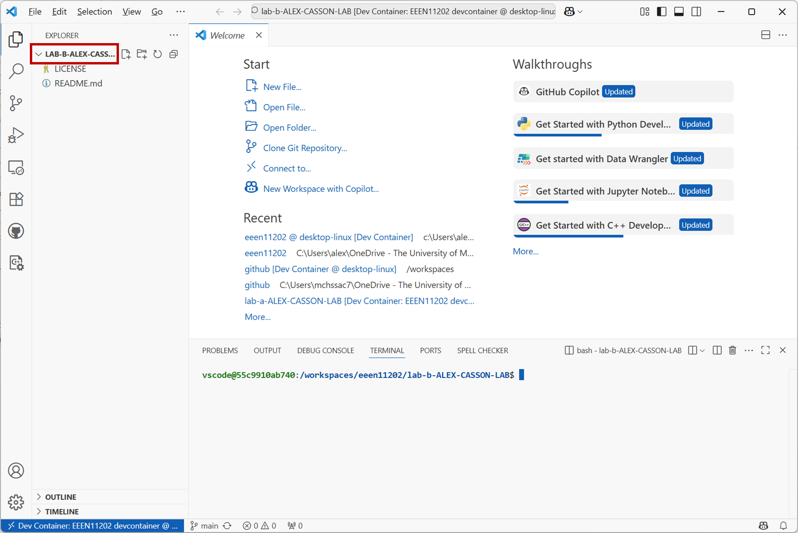
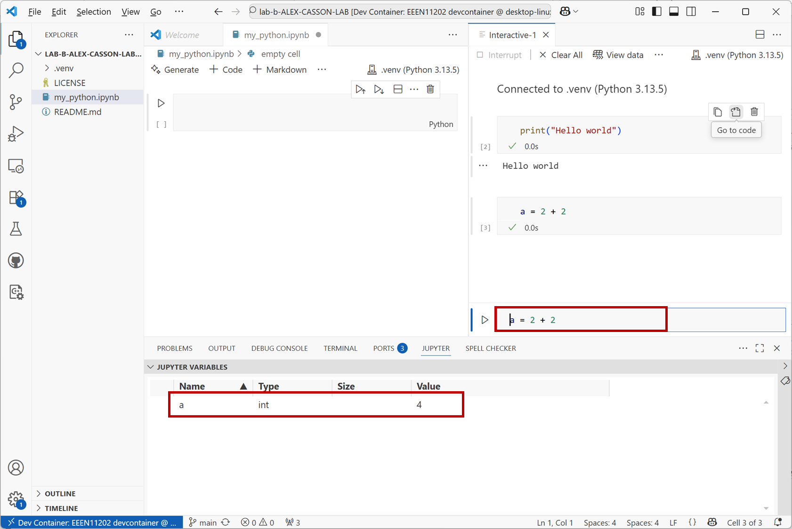

.. role:: console(code)
   :language: console

.. role:: python(code)
   :language: python

.. _lab_b1:

Virtual environments and Jupyter notebooks
==========================================

.. _starting_the_environment:

Starting the programming environment
------------------------------------
`Follow the instructions for getting access to a suitable programming environment on your computer <https://uom-eee-eeen11202.github.io/chapters/useful_information/install.html>`_. If you have any difficulties, ask a demonstrator in a lab session for help.

When done, you should have a view like the below. You'll see there's already a file called :console:`lab_b.ipynb` present. We won't use this until `Assignment B <https://uom-eee-eeen11202.github.io/notes-part2/chapters/week2/assignment_b.html>`_

   Screenshot of VSCode, software from `Microsoft <https://code.visualstudio.com/>`_. See `course copyright statement <https://uom-eee-eeen11202.github.io/chapters/about/copyright>`_.

Making a virtual environment
----------------------------
Before we can start programming in Python we first need to make a :ref:`virtual environment <virtual_environments>`. 

In `Lab C <https://uom-eee-eeen11202.github.io/notes-part2/chapters/week3/lab_c.html>`_ we'll make a Python *project* which automates some of this process for us. For this first Python lab however we'll do it by hand to give you the experience. Using a Python project is best practice, but you'll find lots of examples on the Internet that give you instructions to install things manually, and so we'll give you some examples of this here so that you can do it if needed. 

We make a virtual environment at the command line, as we used in `Lab C <https://uom-eee-eeen11202.github.io/notes-part2/chapters/week2/lab_a.html>`_. We're not using Python yet! The command prompt in the terminal will look like :console:`$` rather than :console:`>>>`. :console:`$` is the computer's command prompt, while :console:`>>>` is the Python command prompt.

.. admonition:: Aside
   :class: dropdown

   There are multiple different ways of making a virtual environment. You may see examples on the Internet using
   
   .. prompt::
      :language: bash
        
      python -m venv .venv
      
   or 

   .. prompt::
      :language: bash
        
      conda create --name .venv
      
   We're going to use an approach with a tool called :console:`uv`. If you see instructions using a different approach, they all have similar commands that are fairly intuitive to map between different tools.

#. In the VSCode terminal enter:

   .. prompt::
      :language: bash

      cd /workspaces/`ls /workspaces`/lab-b
      uv venv .venv

   Remember to enter these one at a time, not both together.

   This will make a new virtual environment. The environment is called :console:`.venv`. The information it needs is stored in the current folder together with your code files, but in general you shouldn't need to look at this. They're there in the background to help Python work.

   To analyze these lines:

   - :console:`cd /workspaces/\`ls /workspaces\`/lab-b` makes sure we are working in the lab-b folder.
   - :console:`uv venv .venv` is the interesting command. This actually sets up our virtual environment.

#. The above command makes a virtual environment, but it doesn't turn it on. In general, you only need to make a virtual environment once. You then just need to use it. To turn on the virtual environment, enter:

   .. prompt::
      :language: bash

      source .venv/bin/activate

   Done correctly :console:`(.venv)` will be displayed in the terminal to show which virtual environment you're currently using. Your VSCode setup should look like the below.

   .. figure:: ./images/venv_setup.png
      :width: 800
      :align: center
      :alt: Making and starting a virtual environment in VSCode

      Screenshot of VSCode, software from `Microsoft <https://code.visualstudio.com/>`_. See `course copyright statement <https://uom-eee-eeen11202.github.io/chapters/about/copyright>`_.

#. Install the :console:`ipykernel` package by entering the command

   .. prompt::
      :language: bash

      uv pip install ipykernel==6.31.0

   This will download some optional Python parts from the Internet and install them into your virtual environment. It's important your virtual environment is turned on before you do this, otherwise it may be installed in the wrong place. :console:`ipykernel` is something that's needed to make the Jupyter Notebooks we'll use later on work. There are lots of optional packages that you can download from the Internet, it's common to find online tutorials that ask you to run :console:`pip install <package-name>`. As we're using :console:`uv`, we actually use :console:`uv pip install <package-name>`.

.. admonition:: Aside
   :class: dropdown

   If you want to turn off a virtual environment after it's been started you can enter :console:`deactivate` in the terminal.

   If you want to use a different name for your virtual environment you can enter :console:`uv venv my-venv` where :console:`my-venv` is the name you want. Note that the lab setup expects the virtual environment to be called :console:`.venv`. If you use a different name you may get errors later on due to what our system is expecting the name to be.

   If you want a specific version of Python in your virtual environment, rather than just the default, you can enter :console:`uv venv --python 3.14 .venv` where :console:`3.14` is the Python version you want. In general we'll just use the default, but if you're downloading Python code from the Internet it may well expect you to be using a specific version of Python. 

Starting Python in Jupyter mode interactively
---------------------------------------------
When working interactively we can store our commands in a file with a :console:`.ipynb` extension. This is known as a *Jupyter Notebook*.

#. Make a new *Jupyter Notebook*. Go to the command palette, that is, the search box at the top of the VSCode window. Click :console:`Show and Run Commands`.

   .. figure:: ./images/vscode_show_and_run_commands.png
      :width: 800
      :align: center
      :alt: The VSCode command palette

      Screenshot of VSCode, software from `Microsoft <https://code.visualstudio.com/>`_. See `course copyright statement <https://uom-eee-eeen11202.github.io/chapters/about/copyright>`_.

#. Search for :console:`Create: New Jupyter Notebook` and click on this option. Or, scroll down and select it from the list of available commands.

   .. figure:: ./images/vscode_create_new_notebook.png
      :width: 800
      :align: center
      :alt: Create new notebook command

      Screenshot of VSCode, software from `Microsoft <https://code.visualstudio.com/>`_. See `course copyright statement <https://uom-eee-eeen11202.github.io/chapters/about/copyright>`_.

#. This opens a blank file, like that shown below. 

   .. figure:: ./images/blank_notebook.png
      :width: 800
      :align: center
      :alt: An empty Jupyter Notebook

      Screenshot of VSCode, software from `Microsoft <https://code.visualstudio.com/>`_. See `course copyright statement <https://uom-eee-eeen11202.github.io/chapters/about/copyright>`_.

#. You need to save this to give it a name. Click on :console:`File / Save As...` and enter a name. Anything is fine. In the example below it is called :console:`my_python.ipynb`. **Make sure you save it in your :console:`lab_b` folder.**

   .. figure:: ./images/vscode_saving_notebook.png
      :width: 800
      :align: center
      :alt: The Save As... interface in VSCode

      Screenshot of VSCode, software from `Microsoft <https://code.visualstudio.com/>`_. See `course copyright statement <https://uom-eee-eeen11202.github.io/chapters/about/copyright>`_.

#. At the moment, the file is empty, and it also doesn't know which virtual environment it should be using. You might have lots of different virtual environments on your computer as you work on more and more Python projects. You need to explicitly tell the file which to use. 

   Click :console:`Select Kernel` in the top right of the screen and then on :console:`Python Environments...` in the dropdown that appears. 

   .. figure:: ./images/vscode_select_kernel.png
      :width: 800
      :align: center
      :alt: The VSCode select kernel button 

      Screenshot of VSCode, software from `Microsoft <https://code.visualstudio.com/>`_. See `course copyright statement <https://uom-eee-eeen11202.github.io/chapters/about/copyright>`_.

   You may see a number of options here. Select the one called :console:`.venv`. In the screenshot below, the ones labelled :console:`/usr/` and :console:`/bin/` are the computer's built-in Python environments. We don't want to use these, we wnt to use the one we made specifically for this lab. 

   .. figure:: ./images/vscode_select_kernel2.png
      :width: 800
      :align: center
      :alt: Selecting the .venv virtual environment

      Screenshot of VSCode, software from `Microsoft <https://code.visualstudio.com/>`_. See `course copyright statement <https://uom-eee-eeen11202.github.io/chapters/about/copyright>`_.

   Done correctly, you'll now see that VSCode displays the name of the virtual environment being used in the top right hand corner of the screen.

#. We'll do one more customization before we starting writing code. This step isn't critical, but it gives a slightly different interface, more similar to Matlab, which lots of electronic engineers are familiar with (or will become familiar with!) and so we'll set it up this way. 

   Go to the command palette, that is, the search box at the top of the VSCode window. Click :console:`Show and Run Commands`.

   .. figure:: ./images/vscode_show_and_run_commands.png
      :width: 800
      :align: center
      :alt: The VSCode command palette

      Screenshot of VSCode, software from `Microsoft <https://code.visualstudio.com/>`_. See `course copyright statement <https://uom-eee-eeen11202.github.io/chapters/about/copyright>`_.

   Search for :console:`Jupyter: Create Interactive Window` and click on it. This will open a new sidebar. 
   
   Lastly, also click on :console:`Jupyter` in the horizontal bar in the middle of the screen. 

   .. figure:: ./images/vscode_new_interactive_window.png
      :width: 800
      :align: center
      :alt: Making a Python interactive window

      Screenshot of VSCode, software from `Microsoft <https://code.visualstudio.com/>`_. See `course copyright statement <https://uom-eee-eeen11202.github.io/chapters/about/copyright>`_.

   Your setup should look like that shown below, and we're finally ready to start entering some code!

   .. figure:: ./images/vscode_python_setup.png
      :width: 800
      :align: center
      :alt: Python interactive window fully setup in VSCode

      Screenshot of VSCode, software from `Microsoft <https://code.visualstudio.com/>`_. See `course copyright statement <https://uom-eee-eeen11202.github.io/chapters/about/copyright>`_.

.. admonition:: Recap

   We've had quite a lot of steps there just to get everything set up. It's possible to get going a bit more quickly, but we deliberately didn't do this. Following the steps above will help as you move to bigger projects, and projects as part of a team. It makes it a little more complicated at first, but is worth it in the long run, as opposed to starting quickly and then building in bad habits. 

   Once you've done it a few times the process becomes very familar. Feel free to delete your files and try this part of the lab again to build familarity. 

   To recap the steps:

   #. Start Docker and VSCode. This needs to be done every time you want to work on code.
   #. Make a virtual environment. This only needs to happen once per project. If one's already been made you don't need to do it again. 
   #. Activate the virtual environment. This needs to be done every time you want to work on code in this project.
   #. Install any packages needed for the project. They only need to be installed once. (Recall that in Lab C we'll start using Python projects that will help automate this step.)
   #. Make your Python file. Or, if carrying on an existing project, open the file you want to work on.
   #. Write your code!

Running some Python commands
----------------------------
We're now ready to start entering Python commands!

Before we do this, we'll take a little time to familarise ourselves with the VSCode Python interface. This is shown below, with each of the major parts numbered.

.. figure:: ./images/python_setup.png
   :width: 800
   :align: center
   :alt: Explanation of the Python interactive window

   Screenshot of VSCode, software from `Microsoft <https://code.visualstudio.com/>`_. See `course copyright statement <https://uom-eee-eeen11202.github.io/chapters/about/copyright>`_.

There are four main parts. 

#. The file explorer. This is a display of the files in the current folder. You can click on them to open them. When we start off, all of our code will be in one file. For larger programs it is common to split code across multiple files to help keep it organized. 

#. The file display. This shows the contents of a code file. It is where we enter the Python code. The commands are saved in a file so we can run the same commands later on. 

#. A Python command prompt. Here we can enter Python commands one at a time. This can be a little confusing - we can enter Python into the Python file or into this Python prompt. In general we want to do the former, we write our Python into a file. That way it's saved and we can run the same commands again. Nevertheless, having a prompt present as well is useful for carrying out a few quick tests and calculations. It's a useful addition, even if it's not where we enter code by default. 

#. A display of what `variables <https://uom-eee-eeen11202.github.io/notes-part1/chapters/programming_fundamentals/variables.html>`_ have been made. This is useful for exploring the results of the code once it's been run, allowing us to check that the variables contain what we would expect.

Interactive Python
^^^^^^^^^^^^^^^^^^
First use we'll use the Python command prompt. This is part number 3 in the figure above. 

Enter 

.. prompt::
   :language: python

   print("Hello world")

and press Enter on the keyboard, or the :console:`Execute` button. (Remember, you don't need to enter the :python:`>>>` this is to show where the command prompt is.) This code will display :console:`Hello world` in the Interactive Python window.

.. figure:: ./images/interactive_hello_world.png
   :width: 800
   :align: center
   :alt: Hello world example in Python

   Screenshot of VSCode, software from `Microsoft <https://code.visualstudio.com/>`_. See `course copyright statement <https://uom-eee-eeen11202.github.io/chapters/about/copyright>`_.

Try doing a simple calculation. Enter the command below then then press the :console:`Execute` button

.. prompt::
   :language: python

   a = 2 + 2

You should get a result like the below. Note that Python hasn't actually displayed the result of this sum for us! It's put the result in a `variable <https://uom-eee-eeen11202.github.io/notes-part1/chapters/programming_fundamentals/variables.html>`_ called :python:`a`. If you look at the variable explorer (part number 4 in the figure above) you'll see that :python:`a` has been created, and it has a value of :python:`4`.

   Screenshot of VSCode, software from `Microsoft <https://code.visualstudio.com/>`_. See `course copyright statement <https://uom-eee-eeen11202.github.io/chapters/about/copyright>`_.

When the cursor is in the Python command prompt you can press the :console:`Up` arrow on the keyboard to see the previous commands that you've entered. This is useful for quickly re-entering commands that you want to run again.

We won't do any more with this interface for now, but remember that it's available for quick calculations if you want it in the future. 

File based Python
-----------------
The interactive Python prompt works well, but is generally for entering a single command at a time. When we have lots of commands to run, we want to store them in a file. At the moment we're looking using Python in the :ref:`Jupyter mode interactively <python_modes>` approach. We'll look at other methods in future labs. The :ref:`Jupyter mode interactively <python_modes>` approach includes a number of features to help us write an organise code. 

#. Code is organized into *cells*. We can run a single cell at a time, or all of the cells together. This is useful for testing code, as we can run a single cell to see if it works, and then run the rest of the code once we're happy with it.

   Open your :console:`.ipynb` file and enter 

   .. code-block:: python

      print("Hello world")

   into the cell that's present. Then press the :console:`Execute Cell` button.

   .. figure:: ./images/ipynb_hello_world.png
      :width: 800
      :align: center
      :alt: Hello world example in a Python notebook

      Screenshot of VSCode, software from `Microsoft <https://code.visualstudio.com/>`_. See `course copyright statement <https://uom-eee-eeen11202.github.io/chapters/about/copyright>`_.

   You'll see :console:`Hello world` displayed. 

#. You can add multiple lines of code into a single cell, but for now let's practice making a new cell and putting code into that. 

   Press the :console:`+ Code` button to make a new cell. In this new cell, enter the code

   .. code-block:: python

      b = 3 + 3

   Then press the :console:`Execute Cell` button that's next to this new cell.

   As before, Python doesn't actually display the result of this sum (unless we explicitly ask it to). Instead, you can see in the variable explorer that a variable :python:`b` has been created.

   .. figure:: ./images/ipynb_sum.png
      :width: 800
      :align: center
      :alt: A simple sum example in a Python Notebook
      
      Screenshot of VSCode, software from `Microsoft <https://code.visualstudio.com/>`_. See `course copyright statement <https://uom-eee-eeen11202.github.io/chapters/about/copyright>`_.

#. Make another new cell and enter the block of code

   .. code-block:: python

      # Changing the value of b
      print("Hello again")
      b = 3 * 3

   Run this cell. It includes a `comment <https://uom-eee-eeen11202.github.io/notes-part1/chapters/software_development_tools/comments.html>`_, which is for us to read but isn't executed. There are then two commands. After running the code you'll see that the value of :python:`b` has been updated. 

   .. figure:: ./images/ipynb_sum_updated.png
      :width: 800
      :align: center
      :alt: Another example sum in the Python Notebook

      Screenshot of VSCode, software from `Microsoft <https://code.visualstudio.com/>`_. See `course copyright statement <https://uom-eee-eeen11202.github.io/chapters/about/copyright>`_.

#. This is a code file, and so you can edit any part of it and re-run the code. You don't have to just keep adding things on the end.  

   Click back in the box where you entered :python:`print("Hello world")` and change this to now have :python:`print("Hello Alex")` (or whatever your name is). Then click on the :console:`Execute Cell and Below` button and all of the cells will be run again. 
   
   .. figure:: ./images/ipynb_hello_alex.png
      :width: 800
      :align: center
      :alt: Editing a cell and re-running the Notebook

      Screenshot of VSCode, software from `Microsoft <https://code.visualstudio.com/>`_. See `course copyright statement <https://uom-eee-eeen11202.github.io/chapters/about/copyright>`_.

#. There's lots of other functionality available in the interface. Take some time to edit the commands you've already entered and re-run the code. Explore different options that the interface provides. For example, how do you delete a cell?