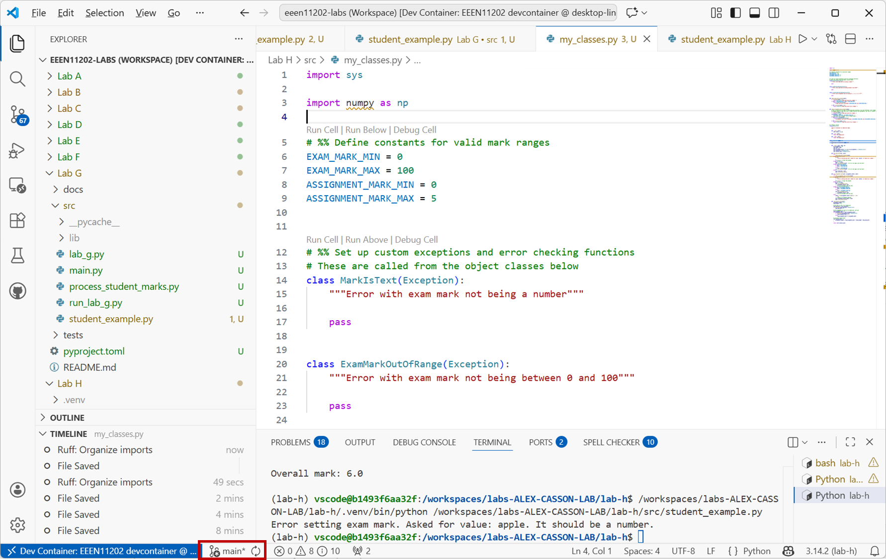

.. role:: console(code)
   :language: console

.. role:: python(code)
   :language: python

.. _lab_h_stage_2:

Git branches
============
We learnt about version control using Git :ref:`back in Lab A <lab_a_stage_2>`. Since, then you've been using it to submit your assignments, and you've been regularly checking in your working code as you go along (you have haven't you?), but we've not said much more about version control. There are lots of features and functions. We're going to look at one of these here, known as *branches*.

In one repository, we can have multiple copies of the same code. These are known as branches. Each branch is version controlled separately and can be worked on separately. The default branch is usually called :console:`main`. VSCode will likely be displaying that you're working on the main branch. 

Working directly in the main branch is fine for small projects. However, it doesn't give a space for experimentation. Essentially, the code in main is your end product. Every time you update this, you're updating the final version. If you're fixing a bug, or adding a new feature, it can be beneficial to make a dedicated branch for this work. You can then get the code working in this branch, and only update main once everything is working. This can help compartmentalize development, and avoid breaking the main code during day-to-day working.

Making a new branch
-------------------
#. In your Lab H workspace, make a new branch called :console:`dev`:

   .. tab-set::
      :sync-group: gui_cli

      .. tab-item:: :fab:`fa-display` GUI
         :sync: key4

          Click on :console:`main` in the bottom left of the VSCode window and then :console:`+ Create new branch`
          
           (you may need to click on the Git icon first). A menu will pop up. Click on :console:`+ Create new branch`. Type in :console:`dev` as the branch name and hit enter.

         .. figure:: ./images/vscode_make_branch1.png
            :width: 800
            :align: center
            :alt: Making a new branch in VSCode

         .. figure:: ./images/vscode_make_branch2.png
            :width: 800
            :align: center
            :alt: Entering the name of the branch in VSCode

         VSCode will automatically switch to the new branch once it's created. You should see :console:`dev` in the bottom left of the VSCode window.

      .. tab-item:: :fab:`fa-terminal` CLI
         :sync: key5

         .. code-block:: console

            git branch dev
            git checkout dev

         The :console:`git branch dev` command makes a new branch, based upon the current branch. The :console:`git checkout dev` switches the branch. Remember that you can use :console:`git status` to check which branch you're on.
   
   You should see the branch name change in the bottom left of the VSCode window.
   
   .. figure:: ./images/vscode_new_branch_display.png
      :width: 800
      :align: center
      :alt: VSCode window with the current Git branch name highlighted

Using and switching branches
----------------------------

#. In your Lab H :console:`src` folder make a new file called :console:`branches.py`. You can put some code into it, or it can be empty for now. 

   This file exists, in the current branch, :console:`dev`, as shown in the view below. (You might need to press the :console:`Refresh` button for the display of files to be updated).

   .. figure:: ./images/file_in_dev.png
      :width: 800
      :align: center
      :alt: VSCode window showing a file in the dev branch

   Check this new file into Git.

   .. tab-set::
      :sync-group: gui_cli

      .. tab-item:: :fab:`fa-display` GUI
         :sync: key4

         On the :console:`Source Control` tab, you should see :console:`branches.py` listed as a new file. Hover over it and click the :console:`+` icon to add it to be tracked. Then enter a commit message in the box at the top and click the :console:`✓ Commit` icon to commit it.

         .. figure:: ./images/vscode_git_commit.png
            :width: 800
            :align: center
            :alt: Committing changes in VSCode

      .. tab-item:: :fab:`fa-terminal` CLI
         :sync: key5

         Assuming your terminal is in the :console:`lab-h` folder

         .. code-block:: console

            git add src/branches.py
            git commit -a -m "Added branches.py in dev branch"

#. Switch back to the main branch:

   .. tab-set::
      :sync-group: gui_cli

      .. tab-item:: :fab:`fa-display` GUI
         :sync: key4

          Click on :console:`dev` in the bottom left of the VSCode window and then click on the main branch that you want to switch to. 

         .. figure:: ./images/vscode_switch_branch.png
            :width: 800
            :align: center
            :alt: Switching branches in VSCode

      .. tab-item:: :fab:`fa-terminal` CLI
         :sync: key5

         .. code-block:: console

            git checkout main

   You'll see that the file :console:`branches.py` is no longer present in the file explorer. This is because it only exists in the :console:`dev` branch. (Again you might need to press the :console:`Refresh` button for the display of files to be updated.)

   .. figure:: ./images/file_in_main.png
      :width: 800
      :align: center
      :alt: VSCode window showing the file is not present in the main branch

   You can see how this lets us work on code in the :console:`dev` branch without affecting the code in the :console:`main` branch.

#. Follow the steps above again to switch back to the :console:`dev` branch. You should see that :console:`branches.py` is back again.

#. In your Lab H :console:`src` folder you will find a file called :console:`practice.py`. When run, it displays :console:`Hello from lab-h!` to the screen.

   Make sure you're in the :console:`dev` branch, and then make some changes to this file. For example, change the message that is displayed to the screen. You could make it:

   .. code-block:: python

      def main():
          print("Hello from lab-h!")
          print("Hello from branch dev!")

      if __name__ == "__main__":
        main()

   Check your changes in to Git. (Follow the instructions above if you're not sure how to do this.)

   Switch back to the main branch (again following the instructions above) and you should see that the same file in the two different branches contain different code. The figure below show the same file in the two different branches.

   .. figure:: ./images/practice_in_main.png
      :width: 800
      :align: center
      :alt: VSCode window showing the contents of a file in branch main

   .. figure:: ./images/practice_in_dev.png
      :width: 800
      :align: center
      :alt: VSCode window showing the contents of a file in branch dev

Merging branches
----------------
#. When you're ready, you can *merge* branches together to combine the code. 

   .. tab-set::
      :sync-group: gui_cli

      .. tab-item:: :fab:`fa-display` GUI
         :sync: key4

         Make sure you are in branch main. Then, on the :console:`Source Control` tab, click on the three dots :console:`...` at the top right to open the menu. Select :console:`Branch / Merge Branch...`.

         .. figure:: ./images/vscode_merge1.png
            :width: 800
            :align: center
            :alt: Switching branches in VSCode

         Select the branch that you want to merge into main. We only have one other branch, dev, in our example. 

         .. figure:: ./images/vscode_merge2.png
            :width: 800
            :align: center
            :alt: Switching branches in VSCode

      .. tab-item:: :fab:`fa-terminal` CLI
         :sync: key5

         .. code-block:: console

            git checkout main
            git merge dev

         This merges the changes from branch dev into branch main. 
   
   You should see that the code in the main branch has now been updated to include the changes you made in the dev branch.

   .. figure:: ./images/vscode_merged_branches.png
      :width: 800
      :align: center
      :alt: VSCode showing updated code in the main branch

#. The above was a nice simple example, we only changed a small bit of code. You can have *conflicts* when you try to merge branches. These occur if the same code has been edited in two different ways in the two branches. Git won't automatically know which version to keep and so you have to *resolve* conflicts manually. We won't cover resolving conflicts here, but as you move on to more advanced version control this might be something you want to look in to. 