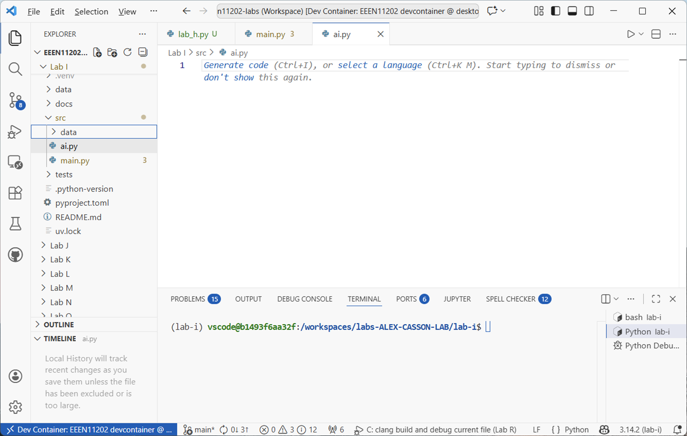

.. role:: console(code)
   :language: console

.. role:: python(code)
   :language: python

.. _lab_i_stage_2:

Using AI for coding
===================
The second aspect of AI is using it to help us write code. Clearly AI can generate code from scratch, and this is changing how we carry out our programming. 

We're going to attempt to do a few things with AI in this part of the lab. Note however that AI is a fast moving field. The material here might be out of date by the time you read it! AI also isn't deterministic. The responses you get back will be specific to you. They will depend on your history of prompts, the exact wording you use, and the version of the AI model being used (with new models being released all the time). Moreover, if lots of students start asking the same things, the AI might learn the correct response. So your experience may differ from what is described here. We will give it a go anyway and hope that it's useful.

We're going to use GitHub Copilot as our AI tool, as it's well integrated into VSCode and `is available for free for students <https://docs.github.com/en/copilot/how-tos/manage-your-account/get-free-access-to-copilot-pro>`_. You can use a different tool if you prefer, but the instructions here will be specific to Copilot.

.. danger::

   Make sure you are familiar with the `course policy and University regulations on the use of AI <https://uom-eee-eeen11202.github.io/chapters/course_policies/ai_use.html>`_.

   We're using AI in this lab, but AI tools will not be available in the closed book exam. 

What should I use AI for
------------------------
The first step is thinking about what you want to use AI for. When we start a new code file, we're presented with a blank text file for us to type in, as shown below. 

   Screenshot of VSCode, software from `Microsoft <https://code.visualstudio.com/>`_. See `course copyright statement <https://uom-eee-eeen11202.github.io/chapters/about/copyright>`_.

One use of AI, probably the first that comes to mind, is to get AI to fill this blank screen with code for us. (Indeed, this is what VSCode now prompts us to do.) It's fine, but it's not the only possible use or approach to AI. It may, or may not, be the most effective way for you. 

There are possibly quite a few more possible ways of using AI:

- Generating code from scratch, starting with a blank file.
- Adding specific functions to an existing file.
- Explaining code that is already in place to help us understand it.
- Prompting to help fix/debug code that isn't working.
- Generating testing code for existing code.
- Generate test inputs and outputs to check our code.
- Generating documentation for the code.
- Helping us to refactor code. That is, to take code that already fundamentally works, but re-arrange it to make it clearer and more scalable.

Can you think of any others? 

Fundamentally, we'll focus on using AI tools to help us write code, but you should think holistically about where and how you want to use it in your coding. We'll look at two (and just two) ways of using AI for your code.

Auto-complete suggestions
-------------------------
#. Make a new Python file with any suitable name. Copy the code below into this.

   .. code-block:: python

      def main():
          print("Hello from lab-i!")

      if __name__ == "__main__":
          main()

#. If you have GitHub Copilot turned on, you should see an icon in the bottom right of the VSCode window that looks like a robot head. If you click on this, you can see the status of Copilot. If it's not already enabled, enable it now. Make sure that :console:`Inline Suggestions` are enabled.

   .. figure:: ./images/vscode_inline_suggestions.png
      :width: 800
      :align: center
      :alt: VSCode showing the GitHub Copilot status window

      Screenshot of VSCode, software from `Microsoft <https://code.visualstudio.com/>`_. See `course copyright statement <https://uom-eee-eeen11202.github.io/chapters/about/copyright>`_.

#. In the Python file, start entering the code below:

   .. code-block:: python

      def co

   You should see that a suggestion pops up, as shown below.

   .. figure:: ./images/vscode_autocomplete.png
      :width: 800
      :align: center
      :alt: VSCode showing an AI generated function suggestion

      Screenshot of VSCode, software from `Microsoft <https://code.visualstudio.com/>`_. See `course copyright statement <https://uom-eee-eeen11202.github.io/chapters/about/copyright>`_.

   On my computer it suggests making a function called :python:`compute_square`:

   .. code-block:: python

      def compute_square(x):
          return x * x

   If that's what you want it to do, great. You can press the :console:`tab` button, and the code will be inserted. If you don't want the suggestion, you can just keep typing, or press :console:`Esc` on your keyboard. 

   However, there are then a number of things to think about. 

#. **Is this what you want?** Only you know that. You need to have some understanding of your program and how it's structured and what it's trying to do, in order to know the answer to that. Saving some typing is great, especially for boilerplate code, but it's not helping with the other parts of the `software life cycle <https://uom-eee-eeen11202.github.io/chapters/software_development/software_life_cycle.html>`_. 

#. **Is the code correct?** For a simple example like this, it's easy to check by eye. Moreover, it's easy to check because you're doing this in Lab H rather than Lab B. You've already got a lot of familiarity with Python, and so know (for example) that :python:`x * x` is how we do a multiplication. If you were new to Python, you might not know that.

   Checking might not be so easy for longer code. We have methods for dealing with that - primarily writing :ref:`unit tests <lab_d_stage_2>`. You can of course use the same AI to help write the tests, but then you have to ask the same questions again, now about the testing code. 

#. **Is this the best way to do it?** There are often many ways to do the same thing in code. It might be good enough for your needs. Not everything necessarily has to be perfect all of the time. Equally, it might be that using :python:`x ** 2` is a better way to compute the square. For complex algorithms, some code might run much more quickly than others and the first suggestion may or may not be the best one. You need to be able to provide some evaluation of that. 

#. **Does this meet my standards**. For example, here are no comments or docstrings in the suggested code. Is that acceptable to you? If not, you need to add them in yourself. Again for a simple example, this code is pretty self-documenting via it's name.

#. What other factors might you want to consider? Security? Scalability? Maintainability? Anything else? 

Agent based coding
------------------
The second common way of using AI to generate code is to use an agent or prompt. Here you start by giving a description of what you want the code to do, and AI generates the code for you. This is the heart of `vibe coding <https://en.wikipedia.org/wiki/Vibe_coding>`_ where you focus more on describing what you want, and less on the code needed to do it. 

#. Click on the :console:`Toggle Chat` icon in the top menu bar in VSCode. This will open a chat window where you can enter your prompt.

   .. figure:: ./images/vscode_agent.png
      :width: 800
      :align: center
      :alt: VSCode agent chat window

      Screenshot of VSCode, software from `Microsoft <https://code.visualstudio.com/>`_. See `course copyright statement <https://uom-eee-eeen11202.github.io/chapters/about/copyright>`_.

#. In :ref:`Lab C <countdown>`, when we introduced loops, we had an example of a simple countdown function. The code for this is copied below. 

   .. code-block:: python

      # %% For loops
      countdown = range(10,-1,-1)
      for i in countdown:
          print(f"{i}")
      print("Blast off")

   Ask the AI to generate this code for you. You can enter a prompt such as:
   
   .. code-block:: text

      Write a Python function that counts down from 10 to 0 and then prints "Blast off"

   or however you would phrase this. (The above is quite a simple prompt.)

   The result is shown below.

   .. figure:: ./images/vscode_agent_response.png
      :width: 800
      :align: center
      :alt: VSCode file file containing AI generated code highlighted in green

      Screenshot of VSCode, software from `Microsoft <https://code.visualstudio.com/>`_. See `course copyright statement <https://uom-eee-eeen11202.github.io/chapters/about/copyright>`_.

   For me it generates:

   .. code-block:: python

      def countdown():
          """Counts down from a given positive integer to 0 and prints 'Blast off'"""
          for i in range(10, -1, -1):
              print(i)
          print("Blast off")

   Click on :console:`Keep` to accept the code. 

   The style of the print statement is a little different to what we wrote by hand, but there's no manifest change from this. (I might argue that using an f-string makes it easier to add text into the print statement later if were to want to change what's displayed, but it's very minor)

#. In the :python:`main` function add the code:

   .. code-block:: python

      countdown()

   and run the code. You should see the countdown printed out as expected.

#. Let's change this to a (mildly) more complicated function. Ask the agent to: 

   .. code-block:: text

      Write a Python function that counts down from a number given at the input to 0 and then prints "Blast off"

   or however you would phrase this. 

   Again, the output I get is below. 

   .. figure:: ./images/vscode_agent_response_updated.png
      :width: 800
      :align: center
      :alt: VSCode file file containing AI generated code highlighted in green, with changes from the previous code in red

      Screenshot of VSCode, software from `Microsoft <https://code.visualstudio.com/>`_. See `course copyright statement <https://uom-eee-eeen11202.github.io/chapters/about/copyright>`_.

   .. code-block:: python

      def countdown(start):
          """Counts down from a given number to 0 and prints 'Blast off'"""
          for i in range(start, -1, -1):
              print(i)
          print("Blast off")

   Click on :console:`Keep` to accept the code.

#. We can tell by inspection that this code looks correct. Add the following code to the :python:`main` function to use the new countdown function:

   .. code-block:: python

      countdown(5)
      countdown(10.1)
      countdown(-2)
      countdown("hello")
      
   and run the code. (You'll probably need to do these one at a time.)

#. None of the bottom three work correctly. They cause the program to crash or to not display all of the wanted output. Our function is expecting an integer, and indeed a positive integer, in order to work correctly. 

   We studied :ref:`exceptions in Lab H <lab_h_stage_1>`, which we can use to write code that is robust to incorrect inputs.  You might argue we're being a bit unfair on the AI. It did what we asked it to do. This is certainly the case, but the result is code that isn't very robust. Really, we need to ask AI a better question. It becomes even more important if you ask AI to help with more complicated code. This is partly why we have the AI lab now, you had to cover enough background material first to help you ask AI the best questions.

#. Let's try again. Ask the agent to:

   .. code-block:: text

      Write a Python function that counts down from a positive integer given at the input to 0 and then prints "Blast off". If the input is not a positive integer, raise a ValueError exception. Handle this exception to display the ValueError message but not the full traceback.

#. The code I get for this is:

   .. code-block:: python

      def countdown(start):
          """Counts down from a given positive integer to 0 and prints 'Blast off'"""
          if not isinstance(start, int) or isinstance(start, bool):
              raise ValueError("Input must be a positive integer")
          if start < 0:
              raise ValueError("Input must be a positive integer")

          for i in range(start, -1, -1):
              print(i)
          print("Blast off")

      def main():
          print("Hello from lab-i!")
          try:
              countdown(5)
              countdown(10)
          except ValueError as e:
              print(f"Error: {e}")

      if __name__ == "__main__":
          main()

   This looks fairly reasonable. It deleted the cases that were in there with :python:`countdown(10.1)`, :python:`countdown(-2)`, and :python:`countdown("hello")`, for some reason, but these were error cases anyway.

#. It's probably quite cumbersome to have to remember all of the different factors that you might want to include in your prompt for the agent to take into account. Instead, you can make custom agents that have specific instructions built in.

   In the :console:`Agent` window click on :console:`Agent` and then :console:`Configure Custom Agents`. 

   .. figure:: ./images/vscode_custom_agent1.png
      :width: 800
      :align: center
      :alt: VSCode showing the custom agent configuration menu

      Screenshot of VSCode, software from `Microsoft <https://code.visualstudio.com/>`_. See `course copyright statement <https://uom-eee-eeen11202.github.io/chapters/about/copyright>`_.

   Click on :console:`+ Create new custom agent...`.

   .. figure:: ./images/vscode_custom_agent2.png
      :width: 800
      :align: center
      :alt: VSCode showing the custom agent creation menu

      Screenshot of VSCode, software from `Microsoft <https://code.visualstudio.com/>`_. See `course copyright statement <https://uom-eee-eeen11202.github.io/chapters/about/copyright>`_.

   Attach it to Lab I, and give it a name :console:`test` (you'll need to remember this name later). This will automatically make a file called :console:`test.agent.md`.

   This will open a new file where you can define the fixed instructions you want your agent to have. 

   .. figure:: ./images/vscode_custom_agent3.png
      :width: 800
      :align: center
      :alt: VSCode showing the custom agent settings file

      Screenshot of VSCode, software from `Microsoft <https://code.visualstudio.com/>`_. See `course copyright statement <https://uom-eee-eeen11202.github.io/chapters/about/copyright>`_.

#. Look at some of the `examples that GitHub provides <https://docs.github.com/en/copilot/how-tos/use-copilot-agents/coding-agent/create-custom-agents#example-agent-profiles>`_. There are lots more examples `here <https://github.com/github/awesome-copilot/tree/main/agents>`_.

   Pick your favourite example. Some of them are quite detailed, and show the level of prompting design needed to get good performance. You'll also see there are lots! There isn't a single one that is optimal for all situations. 

   Save your updated file with your custom agent. 

#. I picked one focused on testing. The prompt needs to be updated to refer to the wanted agent. For :console:`my_agent`, the prompt becomes:

   .. code-block:: text

      @workspace/test Write unit tests for the countdown function. 

   to ask VSCode to use a specific agent. 

#. The above is just an example. Try some of your own prompts with your custom agent. See what code it generates for you. You might want to try some of the other uses of AI mentioned earlier, such as generating documentation, refactoring code, or explaining code.